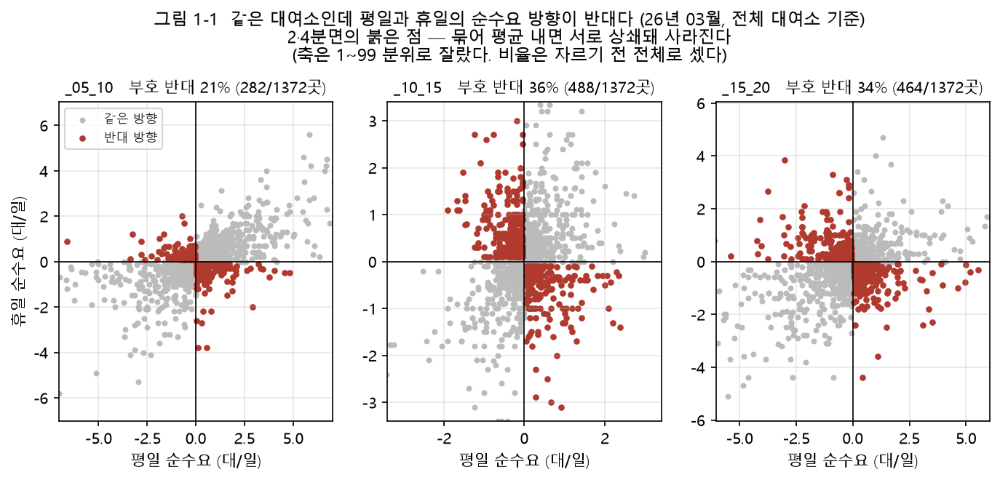

# 제1장 서론

## 1.1 연구 배경

공공자전거는 도시의 근거리 이동 수단으로 자리 잡았으나, 운영 과정에서 대여소 간
재고 불균형이라는 문제를 피하기 어렵다. 출퇴근과 통학처럼 이동에 방향성이 있기
때문에, 어떤 대여소에서는 자전거가 빠르게 소진되고 다른 대여소에서는 반납된
자전거가 쌓이는 일이 매일 반복된다. 이 불균형을 방치하면 자전거가 없어 빌리지 못하는
**결품**(stock-out)과 거치대가 가득 차 반납하지 못하는 **포화**(saturation)가 함께
발생하여 서비스 품질이 떨어진다.

운영 주체는 이를 해소하기 위해 차량으로 자전거가 남는 대여소에서 모자라는
대여소로 재고를 옮기는 **재배치**(rebalancing)를 수행한다. 재배치는 차량과 인력이라는
한정된 자원을 쓰는 작업이므로, 어느 대여소에서 얼마나 옮길지(물량)와 어떤 순서로
방문할지(경로)를 정하는 의사결정 문제가 뒤따른다.

대전광역시의 공공자전거 타슈(TASHU)는 2025년 10월 조사 주간(10월 20~26일)에 하루
평균 23,372건 대여되었고, 가장 많이 대여된 지점은 타슈관제센터였다(대전광역시,
2025). 같은 주의 공개 대여이력을 이 보고서와 대조하면 요일별 이용 비율(요일변동계수)의
차이가 최대 0.03으로 이용의 모양이 일치하고, 대여 1위 지점도 같다. 다만 공개
대여이력의 일별 대여 건수는 보고서 값의 82~87% 수준으로 일정하게 낮으며, 그 원인은
확인하지 못하였다. 이 차이는 제8장에서 가정으로 밝힌다.

본 연구가 다루는 재배치는 대여소에 반납되는 자전거에 한정한다. 대여소가 없는
방식(free-floating)의 자전거는 정해진 거치대에 반납되지 않으므로, 대여소 재고의
불균형이라는 문제 정의가 그대로 적용되지 않는다.

본 연구는 타슈를 대상으로 대여 이력과 대여소 현황 자료로부터 재배치 대상
대여소, 이동 물량, 차량 방문 경로를 자동으로 계산하는 시스템을 설계·구현하고, 그
효과를 대조군과 비교하여 정량적으로 검증한다.

## 1.2 문제 인식

재배치가 필요하다는 판단은 짐작이 아니라 대여소별 **순수요**(대여 건수에서 반납 건수를
뺀 값)로 확인하였다. 같은 대여소라도 평일과 휴일의 순수요 방향이 서로 반대인 경우가
10~15시와 15~20시 시간대에서 대여소의 33~37%에 이른다(<그림 1-1>). 평일에는
자전거가 빠져나가던 대여소가 휴일에는 오히려 자전거가 쌓이는 경우가 드물지 않다는
뜻이다. 두 요일 구분을 하나의 통계로 묶으면 반대 방향의 순수요가 서로 상쇄되어,
실제로 재배치가 필요한 대여소가 통계에서 사라진다. 본 연구가 평일과 휴일의 계획을
처음부터 따로 세우는 것은 이 관측에 근거한다.

<그림 1-1> 같은 대여소의 평일·휴일 순수요. 제2·4사분면에 놓인 대여소는 두 요일
구분에서 순수요의 방향이 반대이다.

설계에 쓰인 운영 조건도 문헌값을 그대로 가져오지 않고 확인을 거쳐 정하였다. 공개
API가 제공하는 거치대 수는 현장과 다른 경우가 있어 현장 지도로 정정하였고, 재배치
차량의 적재 용량은 설계 초기에 15대로 가정하였으나 운영기관에 문의한 결과 최대
10대로 확인되어 관련 설계를 다시 하였다(대전교통공사 타슈 관제센터, 2026). 어떤 값이
확인된 값이고 어떤 값이 아직 가정인지는 제8장에서 정리한다.

## 1.3 관련 동향

재배치 문헌의 검토는 제2장에서 다루고, 여기서는 대상 도시의 동향만 정리한다.

대전교통공사는 2024년 7월 약 700만 건의 타슈 이용 이동 패턴을 분석한 모델을
발표하였다. 보도는 이 모델을 적용할 경우 원도심의 일평균 재배치 건수가 118건에서
159건으로 늘어날 것이라는 전망을 조건부로 제시하였으며, 모델이 실제 운영에
적용되었다는 내용은 담고 있지 않다(한지혜, 2024).

대전광역시의 교통 정책 문서도 재배치를 과제로 적고 있으나 차량으로 재고를 옮기는
운영 방법으로 구체화되어 있지는 않다. 「2025 대전광역시 도시교통정비 중기계획」은
2019년 자전거 이용활성화 계획을 인용하여 "자전거재배치의 혁신(자동화기술,
이용자기반재배치)"을 기술 과제로 적었으나, 실제 사업으로 편성한 '타슈 대여 위치
재배치'는 이용률에 맞추어 대여소의 위치를 옮기는 일로서 별도 예산 없이 기관 자체
인력으로 수행하도록 되어 있다(대전광역시, 2024). 본 연구가 다루는 차량 재배치와는
뜻이 다르다. 본 연구는 이처럼 데이터 기반 차량 재배치가 운영에 적용된 사례가 확인되지
않는 상태에서, 그 의사결정 시스템을 설계·구현하고 효과를 검증하는 데 의의를 둔다.

같은 계획은 기존 자전거에 QR 단말기를 부착하여 지정 장소 밖에서도 대여·반납할 수
있게 하는 도크리스(dockless) 병행 도입 사업도 편성하였고, 그 자문의견은 "가상대여소의
위치 선정에 대한 분석이 필요"하다고 적었다(대전광역시, 2024). 이 전환은 재배치의
단위가 고정 대여소라는 본 연구의 전제와 맞닿는다. 본 연구는 대여소 기반 체계를 대상으로
하며 도크리스 운영 방식을 제안하거나 구현하지 않는다. 다만 제안하는 방법이 고정
대여소라는 단위에 의존하는지는 확인할 가치가 있으므로, 재배치 단위를 거점(가상대여소)으로
바꾸는 경우를 12개월 이용 자료로 예비 검토하였다. 그 결과는 제8장에서 향후 과제로
다룬다.

## 1.4 연구 목적과 연구 질문

본 연구의 목적은 다음 세 가지이다.

첫째, 대여·반납 이력으로부터 대여소별 순수요를 추정하고 안전재고 개념을 적용하여
대여소별 목표 재고를 계산한다.

둘째, 재배치가 필요한 대여소를 선정·군집화하고, 정수선형계획법(ILP)으로 군집 안의
이동 물량을, 차량경로문제(VRP)의 휴리스틱으로 방문 순서를 계산한다.

셋째, 재배치를 하지 않는 경우 및 단순한 대안 방법과 비교하여 제안 시스템이 재고
불균형을 실제로 개선하는지를 **결품 시간**이라는 운영 지표로 검증한다.

이 목적에 따라 본 연구가 답하려는 질문은 다음 셋이다.

- **연구 질문 1.** 대여 이력만으로 세운 재배치 계획이 아무것도 하지 않는 것보다 결품을
  줄이는가.
- **연구 질문 2.** 줄인다면 그 개선이 군집화와 물량 최적화라는 구조에서 오는가, 아니면
  단지 차량을 내보냈기 때문인가. 즉 단순한 그리디 배분보다 나은가.
- **연구 질문 3.** 그 개선은 무엇을 대가로 얻은 것인가. 재배치는 거치대를 채우고 차량을
  움직이므로 편익만 재어서는 답이 절반에 그친다.

연구 질문 1과 2는 제6장의 대조군 비교와 반복 실험으로, 연구 질문 3은 같은 장의
포화 시간과 이동거리 분석으로 답한다.

## 1.5 판정 원칙

본 연구는 무엇으로 재고 무엇을 근거로 채택할지를 실험 전에 정하고, 결과를 본 뒤에는
그 기준을 바꾸지 않는 것을 원칙으로 삼았다. 적용한 규칙은 다음 다섯이다.

1. **판정 지표는 결품 시간으로 고정한다.** 개선률이나 목표 도달률은 목표 재고를 분모로
   삼으므로, 안전재고 계수가 서로 다른 방법끼리는 비교 자체가 성립하지 않는다.
2. **시간대와 요일 구분을 섞어 하나의 평균으로 내지 않는다.** 1.2절에서 보였듯이 수요의
   방향이 반대인 대여소가 많기 때문이다.
3. **파라미터가 비교 대상 집합을 바꾸면 고정된 모집단에서도 잰다.** 각 설정을 그 설정이
   고른 후보 대여소 위에서만 평가하면 후보를 정의한 설정이 유리하게 뽑힌다.
4. **단일 실행이나 단일 난수 씨앗으로 채택하지 않는다.** 군집화가 국소 탐색이어서 한 번의
   결과가 흔들리기 때문이며, 이 규칙은 실제로 결론 하나를 뒤집었다(제7장).
5. **채택 조건을 미리 적어 두고, 표본이 모자라면 기다린다.** 차량 이동시간 추정식을
   교체하는 조건은 "표본 밖 평균절대오차가 기존 상수 속도 가정보다 20% 이상 낮고,
   날짜별 계수의 변동계수가 15% 미만이며, 수집이 10일 이상일 것"으로 미리 정하였다.
   수집 7일째에 앞의 두 조건은 이미 충족되었으나 표본 조건을 앞당기지 않았고, 10일이
   찬 2026년 9월 15일에 판정하여 채택하였다(평균절대오차 25.5% 감소, 날짜별 변동계수
   고정비 2.0%·속도 0.9%).

이 다섯이 처음부터 모두 있었던 것은 아니다. 3번과 4번은 잘못된 비교와 단일 실행의
결과에 한 차례씩 속은 뒤에 세운 규칙이다. 본 연구가 주장하는 것은 처음부터 절차가
완벽했다는 것이 아니라, 규칙을 세운 뒤로는 결과를 보고 규칙을 바꾸지 않았다는
것이다. 어떤 잘못에서 어떤 규칙이 나왔는지는 제7장에 정리한다.

## 1.6 논문의 구성

제2장은 공공자전거 재배치에 관한 선행연구를 문제의 갈래별로 검토하고 본 연구의 위치를
밝힌다. 제3장은 목표 재고, 작업 대상 선정, 군집화, 물량 배분, 방문 순서, 평가 지표를
수식으로 정의하고 각 방법을 선택한 근거를 논한다. 제4장은 시스템의 구조와 데이터
저장소, 차량 운용 규칙, 웹 대시보드를 설명한다. 제5장은 주요 파라미터를 실측으로 정한
과정을, 제6장은 대조군 대비 성능 평가를 제시한다. 제7장은 연구 과정에서 측정으로
뒤집힌 가설을 고찰하고, 제8장은 한계와 향후 과제를 논한다. 제9장에서 결론을 맺는다.
