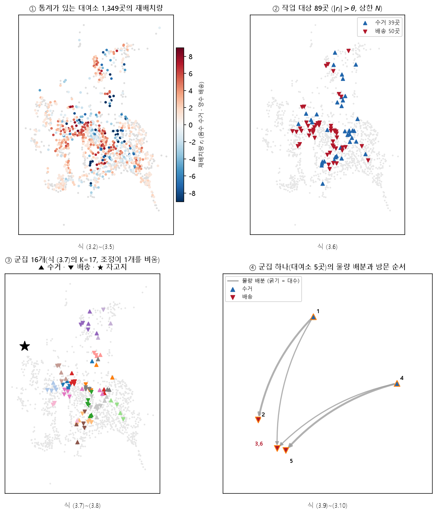
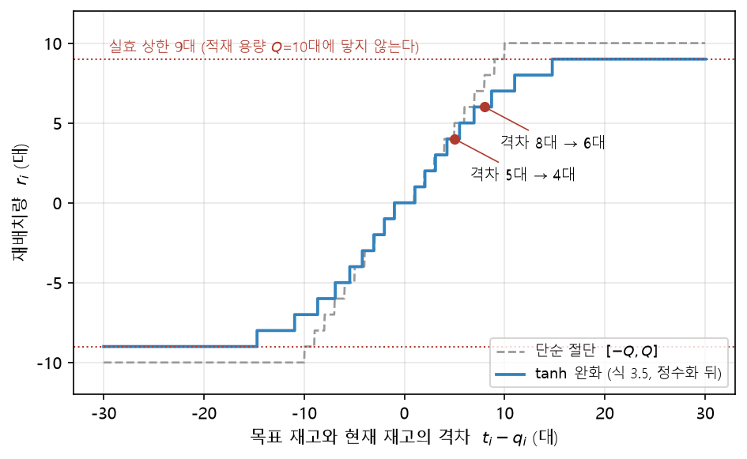
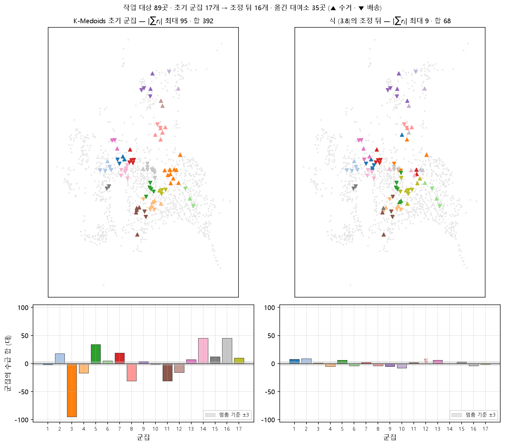
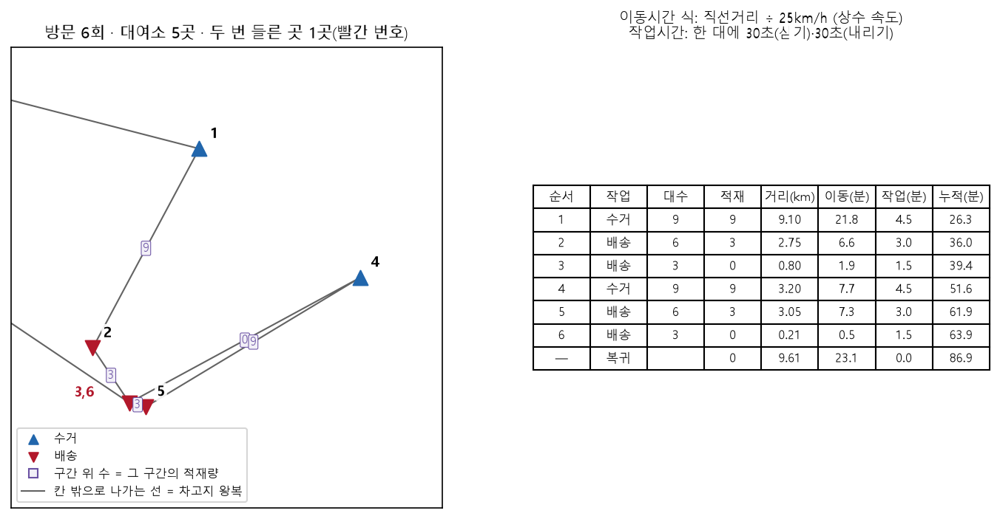
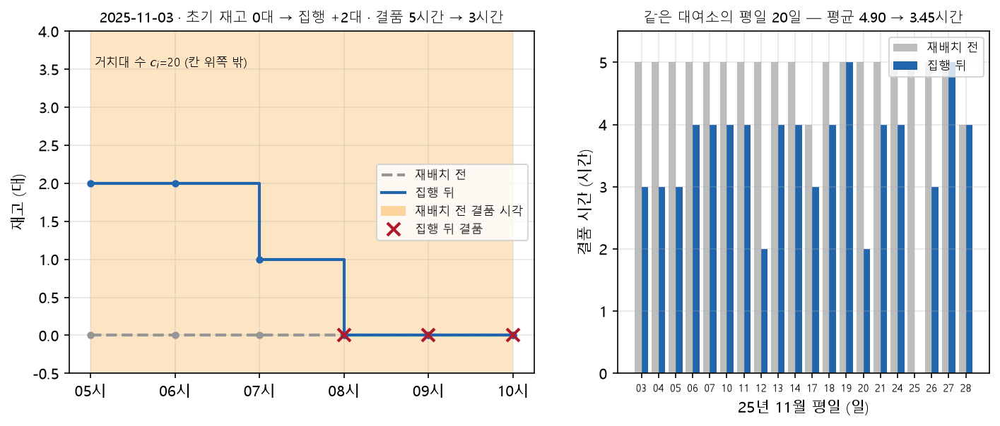

# 제3장 문제 정의와 모형

이 장은 재배치 문제를 정의하고, 본 연구가 그것을 세 단계로 나누어 푸는 모형을 수식으로
제시한다. 각 단계에서 대안 대신 그 방법을 고른 근거를 함께 적는다.

## 3.1 문제 정의와 분해

재배치 문제를 있는 그대로 쓰면, 어느 대여소에서 몇 대를 빼 어디에 놓을지와 차량 몇 대가
어떤 순서로 그 작업을 할지를 적재 용량과 시간 예산 아래에서 동시에 정하면서, 이동거리와
남는 불균형을 함께 줄이는 문제가 된다. 이는 수거와 배송이 있는 다차량 경로문제로서
NP-난해(NP-hard)이며, 본 연구 대상의 대여소 규모(실험에 쓴 재고 스냅샷 기준 1,368곳)에서
한 번에 정확해를 구하는 것은 현실적이지 않다.

본 연구는 문제를 다음 세 단계로 나눈다([그림 3-1]).

$$
\text{군집화(K-Medoids와 수급 균형 조정)} \rightarrow
\text{물량 배분(ILP, 정확해)} \rightarrow
\text{방문 순서(그리디 휴리스틱)}
\tag{3.1}
$$

[그림 3-1] 재배치 문제의 3단계 분해 (2025년 11월 평일 통계, 2026년 8월 11일 재고 스냅샷, 05~10시, 난수 씨앗 42).
① 통계가 있는 대여소 1,349곳의 재배치량, ② 작업 대상 89곳, ③ 조정 뒤 군집 16개, ④ 방문 수가 가운데인 군집 하나의
물량 배분(회색 화살표, 굵기는 대수)과 방문 순서(번호, 두 번 들른 곳은 빨간 번호)이다.

이 분해로 각 단계는 실제로 풀리는 크기가 된다. 군집화는 약 42초, 정수선형계획과 경로
계산은 군집당 수 초 안에 끝난다. 단계별로 결과를 검증할 수 있고 한 단계만 바꾸어 실험할
수 있으므로, 제6장의 대조군 실험도 이 구조 덕분에 가능하다.

잃는 것은 전체 최적성이다. 군집을 먼저 고정하면 군집 경계를 넘는 더 나은 이동은 후보에
오르지 못한다. 군집 A의 과잉을 인접한 군집 B의 부족으로 옮기는 것이 전체로는 최선이어도,
현재 구조는 A 안에서만 해를 찾는다. 이 손해의 크기는 측정하지 않았다. 재려면 분해하지
않은 모형을 풀어야 하는데, 그것이 애초에 분해로 피하려 한 계산이기 때문이다. 대신 군집화
목적함수에 수급 불균형 항을 두어, 군집이 처음부터 자기 안에서 수급이 맞도록 하였다.
경계를 넘어야 할 필요 자체를 줄이는 완화 장치이다.

## 3.2 기호

<표 3-1>에 본 장에서 쓰는 기호를 정리한다. 값의 근거는 해당 절과 제5장에서 다룬다.

<표 3-1> 기호와 기본값

| 기호 | 뜻 | 값 |
| --- | --- | --- |
| $S$ | 대여소 집합 | 실험 스냅샷 1,368곳 |
| $c_i$ | 대여소 $i$의 거치대 수 | |
| $q_i$ | 대여소 $i$의 현재 재고 | 계획 시점 스냅샷 |
| $D$, $H(D)$ | 계획 시간대와 그에 속한 시각의 목록 | 05~10, 10~15, 15~20, 20~05시 |
| $n_{i,d,h}$ | 대여소 $i$의 $d$일 $h$시 순수요(대여 − 반납) | |
| $\mu_i$, $\sigma_i$ | 시간대 $D$의 일별 순수요의 평균과 표준편차 | |
| $s$ | 계절 배율(도시 전체 하나) | $[0.5, 2.0]$ |
| $z$ | 안전재고 계수 | 1.99 |
| $t_i$ | 목표 재고 | |
| $r_i$ | 재배치량(양수는 배송 필요, 음수는 수거 가능) | |
| $\theta$ | 작업 대상 임계값 | 2대 |
| $N$ | 수거·배송 후보 각각의 상한 | 50곳 |
| $K$, $C_k$, $m_k$ | 군집 수(투입 차량 수), $k$번째 군집, 그 메도이드 | |
| $Q$ | 차량 적재 용량 | 10대 |
| $\tau(d)$ | 직선거리 $d$ km의 차량 이동시간(초) | 식 (3.9) |
| $s_{\text{pick}}$, $s_{\text{drop}}$ | 자전거 1대 싣기·내리기 시간 | 각 30초 |
| $c_{\text{tr}}$ | 군집 수 추정에 쓰는 대여소당 이동시간 | 12.5분<!--A:EXP 5-G--> |
| $\rho$ | 군집 간 소요시간 편차 여유 | 1.4<!--A:EXP 5-G--> |
| $B$ | 회차 시간 예산(목표) | 120분 |
| $M$ | 보유 차량 | 21대 |
| $0$ | 차고지(타슈관제센터) | |

## 3.3 수요 추정과 목표 재고

### 3.3.1 시간대 순수요

시간대 $D$의 하루 순수요와 그 평균·표준편차를 다음과 같이 정의한다.

$$
N_{i,d} = \sum_{h \in H(D)} n_{i,d,h}, \qquad
\mu_i = \operatorname{mean}_d N_{i,d}, \qquad
\sigma_i = \operatorname{std}_d N_{i,d}
\tag{3.2}
$$

여기서 $d$는 계획 대상 달의 직전 한 달 가운데 평일과 휴일 중 한쪽만 쓴다. 휴일은 주말과
공휴일의 합집합이다. 두 구분을 섞으면 대여소의 33~37%에서 순수요의 방향이 상쇄된다(1.2절).

### 3.3.2 계절 배율

직전 달의 통계로 이번 달을 계획하므로, 이용이 급변하는 달(예: 2월에서 3월)에는 수요가
구조적으로 낮게 추정된다. 이를 보정하기 위해 계획 대상 달의 첫 $W=14$일 실적으로 도시
전체의 배율 하나를 구한다.

$$
s = \operatorname{clip}\!\left(
\frac{\sum_{i \in S^{+}} \left| \overline{N^{\text{head}}_i} \right|}
     {\sum_{i \in S^{+}} \left| \mu_i \right|},\ 0.5,\ 2.0 \right),
\qquad
S^{+} = \{\, i : |\mu_i| > 2 \,\}
\tag{3.3}
$$

$\overline{N^{\text{head}}_i}$는 첫 14일의 일평균 순수요이다. 수요가 0에 가까운 대여소를
$S^{+}$로 제외하는 것이 중요하다. 이들을 포함하면 잡음의 절댓값이 분자에 더해져 배율이
과대추정된다. 보정은 $\mu_i \leftarrow s\mu_i$, $\sigma_i \leftarrow s\sigma_i$로 분포의
척도를 옮기는 것이며, $z$처럼 여유만 더하는 것과 다르다.

### 3.3.3 목표 재고와 재배치량

목표 재고는 순수요의 방향에 따라 다르게 둔다.

$$
t_i =
\operatorname{clip}\!\left(
\begin{cases}
s\mu_i + z \cdot s\sigma_i & (\mu_i \ge 0) \\[4pt]
q_i + s\mu_i & (\mu_i < 0)
\end{cases}
,\ 0,\ 1.5\,c_i \right)
\tag{3.4}
$$

순유출($\mu_i \ge 0$) 대여소는 그 시간대에 빠져나갈 양에 여유를 더해 미리 채우고,
순유입($\mu_i < 0$) 대여소는 들어올 양만큼 재고를 비운다. 재배치량은 목표와 현재의 차이를
적재 용량 근처에서 완만하게 자른 값이다.

$$
r_i = \operatorname{int}\!\left( Q \cdot \tanh\!\left(\frac{t_i - q_i}{Q}\right) \right)
\tag{3.5}
$$

$\tanh$ 완화는 실험으로 정한 것이 아니라 관행값이다. 이 완화의 실효 상한은 $Q$가 아니라
$Q-1$이다. $|r_i|=Q$가 되려면 부동소수 계산에서 $\tanh$가 1.0으로 포화해야 하는데, 그러려면
$|t_i-q_i|$가 190대 이상이어야 한다. 실제 산출물 10,740행에서 $|t_i-q_i|$의 최댓값은
55.6대였으므로 관측되는 $|r_i|$는 9에서 끊긴다. 또한 이 완화는 상한뿐 아니라 전 구간을
아래로 당긴다(격차 5대는 4대, 8대는 6대가 된다, [그림 3-2]). 격차를 $[-Q, Q]$로 단순히 자르면 총 계획
작업량이 12.9% 늘지만(8,020행에서 10,260대에서 11,584대), 운영기관이 확인한 적재량은
"통상 7대, 많이 실어야 10대"이므로 $Q$를 통상 적재량처럼 쓰는 편이 현장과 더 멀다. 본
연구는 현행 완화를 유지한다.

[그림 3-2] 재배치량의 $\tanh$ 완화와 단순 절단의 비교 ($Q=10$). 계단은 정수화 뒤의 값이고, 점선은 실효 상한
9대이다.

### 3.3.4 목표 재고 방식을 고른 근거

목표 재고를 기계학습으로 정하는 방법을 세 차례 시도하였고, 채택하였다가 되돌린 경우도
있다(<표 3-2>).

<표 3-2> 목표 재고 산정 방식의 시도

| 시도 | 방법 | 결과 |
| --- | --- | --- |
| 1차 | 분위수 회귀($q=0.95$) | 표본 밖 커버리지가 90~94%로 지속적으로 낮아 채택하지 않음 |
| 2차 | 분위수 회귀($q=0.97$)와 계절 배율 | 검증 8개월 중 7개월 우세하여 채택하였으나, 비교 기준의 계절 배율이 과대추정되어 있었음을 발견하고 되돌림 |
| 3차 | 기상 변수 추가 | 목표 커버리지(95%)와의 차이는 0.6%p에서 0.2%p로 줄었으나 과잉 재고가 함께 늘어 채택하지 않음 |

최종적으로 식 (3.4)의 $\mu + z\sigma$를 남겼다. 평균만 채우면 절반의 날은 부족하므로 여유
$z\sigma$를 더한다. 12개월 자료의 표본 밖 검증에서 95%를 덮는 데 필요한 $z$는 시간대에 따라 평일 1.95~2.09,
휴일 2.16~2.23으로 나타났고, 1.99를 골랐다. 이 값을 실제로 적용하면 커버리지는 평일 94.9%, 휴일
93.7%로 의도한 95%에 조금 못 미친다. 결품 시간으로 재면 1.65보다 낮은 값은 뚜렷하게 나빴으나
1.65~2.81 안에서는 값을 가릴 수 없었다<!--A:EXP 18·22-->. 그 구간에서 1.99를 고른 근거는 커버리지와
작업량이다. 커버리지가 95%에 가깝고, 95.5%로 의도를 넘기는 2.10보다 작업량이 적다(제5장).

안전계수가 필요한 이유는 순수요 분포의 꼬리가 두꺼워서가 아니었다. 대여소별로 보면
순수요는 정규분포에 가깝고, 주된 원인은 지난달 통계로 이번 달을 맞히는 추정 오차였다.
휴일의 표본 밖 커버리지는 모든 $z$에서 평일보다 약 1.2%p 낮은데, 평일 표본을 휴일과 같은
10일로 줄이면 커버리지가 93.8%로 휴일과 같아진다. 휴일이 낮은 것도 수요의 성질이 아니라
표본 크기 때문이며, 처방은 더 큰 $z$가 아니라 더 많은 표본이다.

이 과정에서 이후 모든 실험의 규칙이 된 네 가지 기준을 얻었다. 작업 대상 대여소에서만
평가하고, 평일과 휴일을 따로 재고, 표본 밖에서 재고, 기준선을 의심한다. 2차 시도의 우위는
모형이 좋아서가 아니라 비교 기준이 나빠서 생긴 것이었다.

$\mu + z\sigma$로 얻은 것은 단순함이다. 계산이 한 줄이고, 값의 이유를 현장에 설명할 수
있으며, 모형 파일과 재학습 주기가 필요 없다. 잃은 것은 대여소 사이의 정보 공유이다. $z$가
모든 대여소에 같은 상수로 적용되므로 표본이 8~13일뿐인 휴일에도 각 대여소가 자기 통계만으로
계산된다.

한편 예측하는 대상을 순수요에서 결품으로 옮기면 기계학습이 기준선을 이겼다. 순수요의
잔차 자기상관은 0.30으로 같은 대여소 안에서 시간에 따라 배울 것이 거의 없었으나, 관측
재고로 "이 대여소가 1시간 뒤에 비어 있을 확률"을 물으면 잔차 자기상관이 0.790이고 시간에
따른 변동(0.411)이 대여소 간 차이(0.262)보다 컸다. 이 자리에서 기울기 부스팅 분류기는
결과를 보기 전에 정한 조건, 곧 날짜로 분할할 것, 두 기준선을 모두 이길 것, AUC가 아니라
Brier 점수로 판정할 것을 통과하였다. Brier 점수는 0.1660으로, "지금 비어 있으면 계속
비어 있다"는 지속 규칙(0.2394)보다 30.7% 낮고 대여소·시간대별 과거 빈도(0.2088)보다도
낮았으며, 라벨을 무작위로 섞어 학습하면 0.2503으로 무작위 수준이 되어 정보 누출은 없었다.
그러나 이 모형은 어디가 빌지를 말할 뿐 얼마나 옮길지는 말하지 않으므로 목표 재고를 대신하지
못하고, 재배치 계획에 연결하여 결품·포화·이동거리를 잰 적도 없다. 학습 자료도 평일 13일의
주간(07~22시)뿐이다. 따라서 채택하지 않고 제8장의 향후 과제로 둔다.

## 3.4 작업 대상 선정

재배치량이 임계값을 넘는 대여소만 후보로 삼고, 수거와 배송 후보를 각각 상위 $N$곳까지 남긴다.

$$
P = \operatorname{top}_{N}\{\, i : r_i < -\theta \,\}, \qquad
G = \operatorname{top}_{N}\{\, i : r_i > \theta \,\}
\tag{3.6}
$$

순위는 $|r_i|$의 내림차순이다. 이어서 수거 가능량과 배송 필요량 가운데 작은 쪽
$\Lambda = \min(|\sum_{i\in P} r_i|, \sum_{j\in G} r_j)$까지만 누적합으로 남겨 $P'$와 $G'$를
얻는다. 받아 줄 곳이 없는데 싣기만 하는 계획을 막기 위해서이다. $P'$와 $G'$ 중 한쪽이라도
비면 그 회차는 재배치가 성립하지 않으므로 건너뛴다.

$\theta$와 $N$은 관행값이지만 민감도를 측정하였다. $\theta$는 1~3에서 결품의 차이가 난수
씨앗에 따른 흔들림 수준이었고 5부터 나빠졌다. $N$은 최적값이 아니다. 고정된 모집단에서
재면 상한이 클수록 결품은 줄지만, 작업량이 함께 늘어 상한 100에서는 12대 중 11대가 시간
예산을 넘겼다<!--A:EXP 17-->. 결품과 예산 준수가 맞바뀌므로 $N$은 초과를 어디까지 받아들일지라는
운영 정책의 선택이며, 그 측정은 제5장에서 다룬다.

## 3.5 군집화

### 3.5.1 군집 수

군집 하나는 차량 한 대에 대응하므로, 군집 수 $K$는 그 회차의 작업량을 시간으로 환산하여 정한다.

$$
\hat{T} = \Big(\sum_{j \in G'} r_j\Big) \frac{s_{\text{pick}} + s_{\text{drop}}}{60}
        + |P' \cup G'| \cdot c_{\text{tr}},
\qquad
K = \min\!\left( \max\!\left(1, \left\lceil \frac{\rho \hat{T}}{B} \right\rceil \right),\ M \right)
\tag{3.7}
$$

$\hat{T}$(분)는 회차 전체의 추정 소요시간이다. 앞 항(싣고 내리는 시간)은 정확히 계산되고,
뒤 항(이동시간)은 대여소 수에 비례한다고 본다. 같은 재고에서 $K$만 바꾸어 재면 총
소요시간이 거의 변하지 않았기 때문이다. 군집을 쪼개면 차고지 왕복은 늘지만 군집 안의 이동이
그만큼 준다. $\rho$를 곱하는 것은 시간 예산이 평균이 아니라 가장 오래 걸리는 군집으로
판정되기 때문이다. 이 식으로 정해진 회차당 군집 수는 실데이터에서 12~16이었다<!--A:EXP 5-G-->.

대여소 수 대신 좌표로 이동거리를 어림하는 방식(면적 기반 근사, 최근접 이웃 순회, 최소 신장
트리)도 세 가지 시험하였으나, 넉 달 12개 조합에서 모두 현행보다 오차가 컸다(평균절대백분율오차
현행 7.5%, 대안 8.2~9.4%)<!--A:EXP 13-->. 이 경위는 제7장에서 다룬다.

### 3.5.2 초기 군집과 조정

작업 대상의 위경도 좌표에 맨해튼 거리를 쓰는 K-Medoids(FasterPAM)로 초기 군집을 만든다.
초기 군집은 지리적으로만 뭉쳐 있어 군집 안의 수급이 맞지 않으므로, 다음 목적함수를 줄이는
방향으로 대여소를 하나씩 옮긴다.

$$
J(\mathcal{C}) =
\alpha \sum_{k} \Big( \sum_{i \in C_k} r_i \Big)^{2}
+ \beta \cdot \operatorname{mean}_k \Big( |C_k| - \tfrac{n}{K} \Big)^{2}
+ \gamma \sum_k \sum_{i \in C_k} \| x_i - m_k \|_1,
\qquad \alpha=1,\ \beta=100,\ \gamma=3000
\tag{3.8}
$$

세 항은 차례로 군집 내 수급 불균형, 군집 크기의 균일성, 군집 내 거리를 나타낸다. 모든 군집의
불균형 절댓값이 3 이하가 되거나 더 개선되지 않으면 멈추며, 반복 상한은 200회이다. 거리
가중치 $\gamma$는 비단조적이어서, $\gamma=2000$이 $\gamma=1000$보다 나빴고 10~150 구간에서는
거리 항이 불균형 항에 묻혀 대여소가 움직이지 않았다. 값의 근거는 제5장에서 다룬다.

조정은 군집 수를 보존하지 않는다. 초기 군집에 수거나 배송 한쪽만 있는 작은 군집이 생기면, 조정이 그
대여소들을 이웃 군집으로 모두 옮겨 군집이 비기도 한다. 2025년 11월 평일 05~10시 회차에서는 식 (3.7)의 군집 수 17이
조정 뒤 16이 되었다([그림 3-3]). 반대로 대여소 한 곳만 남은 군집은 안에서 수급을 맞출 수 없어 옮길 물량이 생기지
않으며, 같은 달의 10~15시와 15~20시 회차에서 이런 군집이 하나씩 남았다.

[그림 3-3] 수급 균형 조정 전후의 군집 (2025년 11월 평일 통계, 2026년 8월 11일 재고, 05~10시, 난수 씨앗 42). 위는
작업 대상 89곳을 군집별 색으로, 아래는 군집마다 수급 합 $\sum_{i \in C_k} r_i$를 보인다. 조정은 대여소 35곳을 옮겨
수급 합의 최대 절댓값을 95에서 9로 줄였고, 대여소 2곳뿐이던 수거 군집 하나를 이웃 군집에 흡수시켰다.

### 3.5.3 K-Medoids를 고른 근거

군집화는 작업 대상 대여소를 차량 수만큼의 덩어리로 나누는 일이다. K-Means는 중심이 실제
대여소가 아닌 좌표 평균이 되어 해석이 어렵다. 계층 군집은 군집 수를 정확히 지정하기 어려운데,
이 문제에서는 $K$가 곧 투입 차량 수이므로 반드시 지정해야 한다. DBSCAN은 밀도 기반이라 군집
수를 제어할 수 없고, 대여소가 드문 외곽이 잡음으로 빠질 수 있으나 외곽 대여소도 재배치
대상이다. 지리적으로만 균등하게 나누는 방법은 실제로 대조군으로 만들어 비교하였다(제6장).
거리는 비슷하였지만 군집 안의 수급이 맞지 않아 옮길 수 있는 물량이 크게 줄었다.

K-Medoids는 중심이 실제 대여소여서 해석이 쉽고, 임의의 거리 척도를 받으며, 수급 균형 항을
목적함수에 자연스럽게 넣을 수 있다. 계산은 K-Means보다 느리지만 실측 42초로 문제가 되지
않았다. 대가는 $\gamma$가 비단조적이어서 값을 바꿀 때마다 다시 실험해야 한다는 점이다.

## 3.6 물량 배분

### 3.6.1 정수선형계획

군집 $k$마다 독립적으로 푼다. 수거 집합 $I=\{i \in C_k : r_i<0\}$의 공급을
$\text{sup}_i=|r_i|$, 배송 집합 $J=\{j \in C_k : r_j>0\}$의 수요를 $\text{dem}_j=r_j$로 두고,
결정변수 $x_{ij} \in \mathbb{Z}_{\ge0}$를 $i$에서 $j$로 옮기는 자전거 대수로 둔다.

$$
\begin{aligned}
\min\ & \sum_{i \in I} \sum_{j \in J} \tau(d_{ij})\, x_{ij} \\
\text{s.t.}\ & \sum_{j \in J} x_{ij} \le \text{sup}_i \quad (\forall i \in I), \qquad
\sum_{i \in I} x_{ij} \le \text{dem}_j \quad (\forall j \in J), \\
& \sum_{i \in I}\sum_{j \in J} x_{ij} = \Lambda_k = \min\!\Big(\sum_i \text{sup}_i,\ \sum_j \text{dem}_j\Big)
\end{aligned}
\tag{3.9}
$$

$d_{ij}$는 두 대여소 사이의 직선거리(하버사인)이고 $\tau$는 3.8절의 이동시간 함수이다. 세
번째 제약(작업량 강제)이 없으면 아무것도 옮기지 않는 해가 최적이 되므로 반드시 필요하다.

이 목적함수는 실제 운행시간이 아니다. 차량은 한 번에 최대 $Q$대를 싣고 다니므로 실제
소요시간은 방문 순서가 정한다. 식 (3.9)는 자전거 한 대가 $i$에서 $j$로 옮겨지는 시간을
대수만큼 더한 대리 목적함수, 곧 대수로 가중한 이동시간의 합이며, 가까운 대여소끼리 많이
옮기도록 유도하는 역할을 한다.

### 3.6.2 정수선형계획을 고른 근거

식 (3.9)는 공급과 수요가 있는 수송문제(transportation problem)이며, 제약행렬이 완전
단모듈(totally unimodular)이다. 따라서 선형완화의 꼭짓점 최적해가 자동으로 정수가 되어, 정수
제약을 거는 데 따르는 계산 비용이 이 문제에서는 생기지 않는다. 실측에서도 군집 하나가
0.05~0.2초에 풀렸다.

대안으로는 최소비용흐름 전용 알고리즘, 그리디 매칭, 규칙 기반 배분이 있었다. 전용 알고리즘은
더 빠르지만 이미 0.2초여서 얻을 시간이 없고 제약을 더할 때 정수선형계획이 유연하다. 그리디
매칭은 대조군으로 비교한 결과 총 이동거리가 늘었다. 규칙 기반 배분은 재현과 검증이 어렵다.
정수선형계획으로 얻은 것은 정확해의 보장, 곧 더 좋은 배분이 있는데 찾지 못한 것이 아니라는
점이며, 이것이 대조군 비교의 기준선이 된다.

## 3.7 방문 순서

### 3.7.1 그리디 휴리스틱

차량 한 대가 차고지에서 출발하여 군집 $k$의 작업을 처리하고 차고지로 돌아온다. 현재 위치
$p$, 적재량 $\ell$에서 다음 방문 노드 $u$는 다음 점수가 가장 작은 후보로 고른다.

$$
\text{score}(u) = \frac{d(p,u)}{a_u} \times
\begin{cases} 0.1 & (a_u = \text{잔여량}_u) \\ 1 & (\text{그 외}) \end{cases},
\qquad
a_u =
\begin{cases}
\min(\text{잔여량}_u,\ Q - \ell) & (u\text{가 수거 노드}) \\
\min(\text{잔여량}_u,\ \ell) & (u\text{가 배송 노드})
\end{cases}
\tag{3.10}
$$

가까우면서 한 번에 많이 처리할 수 있는 노드를 먼저 고르며, 0.1의 가중은 한 번의 방문으로
그 노드의 작업을 끝낼 수 있으면 우선한다는 뜻으로서 재방문을 줄인다. 식 (3.9)의 작업량 강제
제약이 군집마다 수거 합과 배송 합을 같게 만들므로, 어느 시점에서든 남은 배송량은 남은
수거량과 적재량의 합과 같다. 따라서 적재함이 가득 차면 내릴 곳이, 비면 실을 곳이 반드시 남아
있어 후보가 비는 상태는 생기지 않는다. [그림 3-4]는 이 규칙이 만든 한 군집의 경로이다.

군집 $k$의 소요시간은 이동시간과 작업시간의 합이다.

$$
\tau_k = \sum_{\text{구간}} \tau(d) + (s_{\text{pick}} \cdot \text{싣는 대수} + s_{\text{drop}} \cdot \text{내리는 대수})
\tag{3.11}
$$

시간 예산 $\tau_k \le B$는 기본 설정에서 모형의 제약이 아니라 계산 뒤의 점검이다. 예산을
넘는 작업 앞에서 멈추고 돌아오게 하는 선택 사항을 두었으나, 켜면 옮기지 못하는 물량이
생기므로 기본으로는 끈다. 120분은 운영기관이 제시한 제약이 아니라 본 연구가 세운 목표이며,
이를 넘는 계획도 집행이 불가능한 것은 아니다. 초과 시간은 실패가 아니라 소요시간의 측정값으로
보고한다.

[그림 3-4] 그리디 휴리스틱이 만든 한 군집의 방문 순서와 적재량 (2025년 11월 평일 통계, 2026년 8월 11일 재고,
05~10시, 난수 씨앗 42의 군집 가운데 방문 수가 가운데인 것). 구간 위의 수는 그 구간을 달릴 때의 적재량이고, 빨간
번호는 같은 대여소를 두 번 들른 곳이다. 차고지는 군집에서 약 9km 떨어져 지도 밖에 있다. 오른쪽 표의 이동시간은
직선거리를 시속 25km로 나눈 값이다.<!--A:EXP 9-->

### 3.7.2 그리디를 고른 근거

범용 최적화 도구(OR-Tools)와 같은 노드, 같은 적재 제약, 같은 차고지 복귀 조건으로 비교하면,
2025년 11월 평일 43개 군집에서 탐색 시간 군집당 10초일 때 그리디 경로가 평균 2.2%, 최악
10.1% 길었다<!--A:EXP 6-->. OR-Tools에 300초를 주면 평균 5.3%, 최악 15.1%로 커지고 아직
수렴하지 않으므로<!--A:EXP 6-->, 이 값들은 손해의 하한이며 탐색 시간과 함께 읽어야 한다. 난수
씨앗을 바꾸면 평균 갭이 1.9~4.9%로 움직였다<!--A:EXP 24-->. 씨앗은 군집 경계를 바꾸므로 경로
문제 자체가 달라지기 때문이다. 조건별 값은 <표 3-3>에 모았다.

<표 3-3> 그리디 경로의 최적성 갭 (OR-Tools 대비, 평일)<!--A:EXP 6·23·24-->

| 비교 축 | 조건 | 군집 수 | 평균 갭 | 최악 갭 | 회수할 수 있는 거리 | 계산 시간 |
| --- | --- | --- | --- | --- | --- | --- |
| 탐색 시간 | 2025년 11월, 군집당 10초, 세 회차 | 43 | 2.2% | 10.1% | 29.8km | 재지 않음 |
| 탐색 시간 | 2025년 11월, 군집당 10초, 05~10시 | 14 | 2.5% | 10.1% | 11.7km | 재지 않음 |
| 탐색 시간 | 2025년 11월, 군집당 60초, 05~10시 | 14 | 3.8% | 16.5% | 17.1km | 재지 않음 |
| 탐색 시간 | 2025년 11월, 군집당 300초, 05~10시 | 14 | 5.3% | 15.1% | 23.2km | 약 63분 |
| 난수 씨앗 | 42 (2025년 11월, 60초, 05~10시) | 16 | 3.9% | 19.5% | 16.1km | 재지 않음 |
| 난수 씨앗 | 7 (같은 조건) | 17 | 1.9% | 9.0% | 8.6km | 재지 않음 |
| 난수 씨앗 | 13 (같은 조건) | 16 | 4.9% | 19.3% | 24.1km | 재지 않음 |
| 달 | 2026년 3월, 60초, 05~10시 | 14 | 3.1% | 14.6% | 11.4km | 재지 않음 |

주: 갭은 같은 노드, 같은 적재 제약, 같은 차고지 복귀 조건에서 (그리디 경로 길이 − OR-Tools 경로 길이) / OR-Tools
경로 길이이다. OR-Tools의 해도 증명된 최적해가 아니므로 모든 값은 하한이다. 계산 시간은 한 회차의 군집 전체를 푸는
데 든 시간이다. 스냅샷이 행마다 다르다. 10초와 60초 행은 정본 이전의 재고 스냅샷, 300초 행은 2026년 8월 26일
스냅샷, 난수 씨앗 행은 2026년 8월 11일 정본 스냅샷, 2026년 3월 행은 차량 대수 실험의 스냅샷으로 재었으므로 행끼리
엄밀한 계열이 아니다.

손해의 절대량은 작다. 300초 기준으로 회수할 수 있는 거리는 회차 전체 23.2km, 군집당 평균
0.7~1.7km(약 4분)인데<!--A:EXP 6-->, 그 대가로 군집마다 300초, 14개 군집이면 약 63분을 계산에
쓴다. 갭이 큰 군집만 다시 최적화하는 절충안도 채택하지 않았다. 손해가 소수 군집에 몰리는
현상이 씨앗 42와 13에서는 나타났으나(상위 군집 갭 19%대) 씨앗 7에서는 최댓값이 9.0%로
나타나지 않았기 때문이다<!--A:EXP 24-->. 또한 경로 최적화는 시간 예산 초과를 푸는 수단이 되지
못한다. 초과 폭이 회수할 수 있는 거리보다 큰 군집은 그대로 남으며, 초과의 원인은 경로가
아니라 군집화가 시간을 모른다는 데 있다. 그리디로 얻은 것은 무거운 의존성 없이 수 초 안에
경로가 나오고, 동작을 따라가며 설명할 수 있다는 점이다.

## 3.8 이동시간

식 (3.9)와 (3.11)의 이동시간은 직선거리 $d$(km)의 함수로 계산한다.

$$
\tau(d) = F + \frac{3600\, d}{v}
\tag{3.12}
$$

고정비 $F$는 신호, 회전, 주정차처럼 거리에 비례하지 않는 시간을, $v$는 직선거리 기준의
실효 속도를 나타낸다. 두 계수는 매일 같은 400개 구간을 상용 경로 안내 API로 다시 조회한
고정 패널 10일(2026년 9월 2일~15일)에서 추정하였으며, 평일 계수는 $F=320.4$초,
$v=32.11$km/h이다. 이 식은 상수 속도 가정($F=0$, $v=25$km/h)보다 표본 밖 평균절대오차가
25.5% 낮았고, 날짜별 계수의 변동계수는 고정비 2.0%, 속도 0.9%였다. 1.5절의 채택 조건을
충족하여 상수 속도 가정을 대체하였다. 휴일 계수는 휴일 표본이 모일 때까지 평일 계수를
쓴다<!--A:게이트 B 휴일 계수 반영 여부-->.

상수 속도 가정은 짧은 구간을 특히 과소평가하였다. 0.5km 이하 구간에서 평균 149초,
1~2km에서 237초가 모자랐고, 10km를 넘어서야 과대평가로 돌아섰다. 재배치 구간의 대부분이
근거리이므로 고정비 항이 필요하다.

(자리 [그림 3-5] — 산점도와 선 그래프. 무엇: 가로축은 직선거리(km), 세로축은 경로 안내 API의 이동시간(초).
고정 패널 400구간 × 10일의 점을 옅게 찍고, 식 (3.12)의 추정선($F=320.4$초, $v=32.11$km/h)과 상수 속도 가정선
($F=0$, $v=25$km/h)을 겹친다. 0.5km 이하와 1~2km 구간에서 상수 속도가 모자라는 폭(149초, 237초)을 표시한다.
자료: 2026년 9월 2일~15일 고정 패널 10일, 평일. 도로 수집은 집 PC(환경 B)가 맡아 이 10일은 그쪽 DB에 있다 —
회사 PC DB에는 9월 1·2일 이틀뿐이어서(2026-09-18 확인) 집 PC에서 그리거나 자료를 합친 뒤 그린다. 계수를 다시 적합할
때는 날짜를 9월 2일~15일로 잘라야 3.8절의 값($F=320.4$초, $v=32.11$km/h)과 같아진다. 캡션(안): 직선거리와 도로 이동시간 — 고정비 모형과 상수 속도
가정)

이 교체는 계획 자체를 바꾸지 않는다. 식 (3.9)에서 작업량 강제 제약으로 $\sum x_{ij}$가
$\Lambda_k$로 고정되므로 고정비 항 $F\Lambda_k$는 상수가 되고, 속도 $v$는 목적함수의 척도만
바꾼다. 따라서 최적해의 집합은 이동시간 식과 무관하다. 식 (3.10)의 방문 순서 규칙과 식
(3.7)의 군집 수도 이동시간 함수를 쓰지 않는다. 식 교체가 바꾸는 것은 식 (3.11)의 소요시간과
그에 따른 시간 예산 판정, 그리고 예산을 넘는 작업을 멈추는 선택 사항을 켠 실험의 결과이다.

## 3.9 평가 지표

재배치 전후의 재고 궤적을 순수요로 복원하여 결품 시간을 계산한다. $h_k$를 $H(D)$의 $k$번째
시각이라 할 때,

$$
q_i^{(k+1)} = \operatorname{clip}\big( q_i^{(k)} - n_{i,d,h_k},\ 0,\ c_i \big),
\qquad
\text{Stockout}_i = \sum_{k=0}^{|H(D)|-1} \mathbb{1}\!\left[ q_i^{(k+1)} \le 0 \right]
\tag{3.13}
$$

이다. 재배치 전에는 $q_i^{(0)}=q_i$, 재배치 후에는 $q_i^{(0)}=q_i+\Delta_i$로 둔다. $\Delta_i$를
계획량 $r_i$로 두면 계획이 모두 집행되었다고 가정하는 계획 기준이 되고, 경로 단계가 실제로
싣고 내린 양으로 두면 집행 기준이 된다. 본 연구는 집행 기준을 쓴다. 계획 기준으로 재면
군집화와 물량 배분을 거치지 않은 대조군도 같은 점수를 받아 방법 간 비교가 성립하지 않기
때문이다(제7장). 재고를 0에서 자르므로 못 빌린 수요는 다음 시각으로 넘어가지 않고 사라지며,
이 값은 결품의 하한이다. 포화 시간은 같은 궤적에서 재고가 거치대 수 $c_i$에 닿은 시각 수로
센다. [그림 3-6]은 대여소 한 곳의 궤적을 이 식으로 복원한 예이다.

[그림 3-6] 재고 궤적의 복원과 결품 시간 (2025년 11월 평일, 05~10시, 2026년 8월 11일 재고). 이 회차에 자전거를 받고
집행 뒤 재고가 거치대 수 안에 드는 배송 대여소 가운데 재배치 전 평일 평균 결품 시간이 가장 긴 곳을 골랐다. 왼쪽은
그 대여소에서 재배치 전 결품이 처음 난 날(11월 3일)의 궤적이고, 오른쪽은 같은 대여소의 평일 20일 결품 시간이다.
2대를 받아도 결품은 평균 4.90시간에서 3.45시간으로 줄어드는 데 그친다.

계획 대비 개선률
$\left(|q_i - t_i| - |q_i + r_i - t_i|\right) / |q_i - t_i|$은 보조 지표로만 쓴다. 분모에 목표
재고가 들어가므로 $z$가 다른 실행끼리는 비교할 수 없고, 이용자 편익이 아니라 계획 달성률을 잰다.

## 3.10 데이터 처리 원칙

1) 이상치

원천 대여이력의 이용시간과 이용거리에 사분위범위(IQR) 1.5배 기준의 이상치 제거를
적용하지만, 이 처리는 계획 경로에 닿지 않는다. 순수요 계산은 대여·반납 시각과 대여소 식별자만
읽기 때문이다. 이것이 결함인지 확인하기 위해 이상치 제거를 계획 경로에 적용해 보았더니 작업
대상 603곳 중 81곳(13.4%)의 판정이 바뀌었다. 그런데 원천 자료의 최댓값이 이미 46분, 3.7km로
잘려 있어 IQR 기준이 잘라내는 것은 오류가 아니라 정상 이용의 상위 4%였다. 따라서 이상치 제거가
계획에 닿지 않는 현재 상태를 옳은 설계로 판정하였다.

2) 결측

결측은 그 빈칸이 뜻하는 바에 따라 처리한다. 강수와 적설의 빈칸은 오지 않았다는
뜻이므로 0으로 채우고, 기온·습도·풍속의 빈칸은 장비 결측이므로 앞뒤 값으로 보간한다. 재고나
거치대 정보가 없는 대여소는 계산할 수 없으므로 제외한다.

3) 정합성

단계 사이에 넘기는 표의 필수 열을 검사하고, 정수선형계획의 수급 균형 제약과 한쪽
후보만 있는 회차를 건너뛰는 장치로 계획의 정합성을 지킨다. 다만 이 검사는 열의 존재까지이며,
값의 범위(음수 재고, 미래 날짜)는 검사하지 않는다.

## 3.11 모형의 구조적 한계

다음은 모형 자체에 내재한 한계이다. 측정된 크기는 제8장에서 함께 정리한다.

- 이동시간은 직선거리에 고정비와 실효 속도를 적용한 추정이며, 실도로 경로는 지도 표시에만 쓴다.
- 경로는 그리디 휴리스틱이므로 최적성이 보장되지 않는다.
- 차량 한 대는 군집 하나만 맡으며, 여러 군집을 이어 도는 구조는 기본 모형에 없다.
- 자전거 1대당 싣기·내리기 30초는 현장에서 측정하지 않은 가정값이다. 이은탁·손봉수(2019)도
  같은 값을 가정하였다.
- 재고 $q_i$는 계획 시점의 스냅샷이고 순수요는 직전 달의 실적이므로 두 값의 시점이 다르다.
- 네 회차는 독립적으로 계획되며, 앞 회차의 결과가 뒤 회차의 초기 재고에 반영되지 않는다.
- 결품은 목적함수에 들어 있지 않고 계획 뒤에 평가한다. 모형은 목표 재고라는 대리 목표를 향해
  움직인다.
