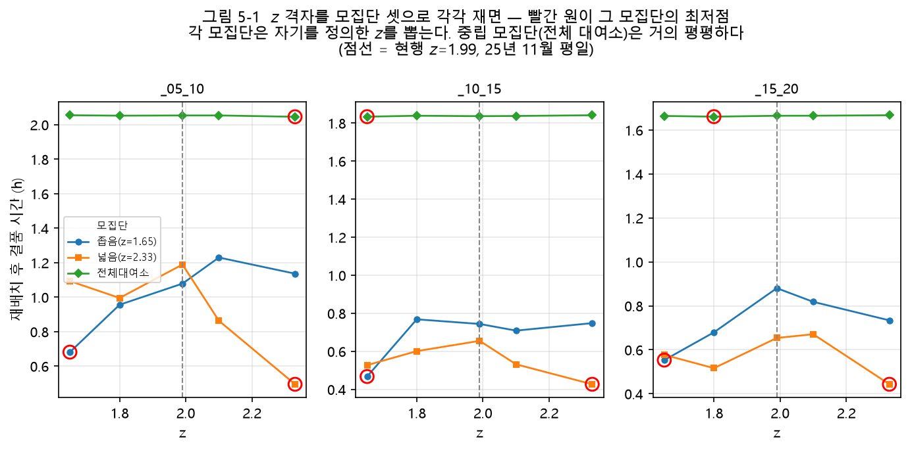

# 제5장 파라미터 결정

## 5.1 개요

제3장의 모형에는 값을 정해야 하는 파라미터가 여럿 있다. 목표 재고의 안전계수 $z$, 계절 배율을
구하는 기간 $W$, 군집화의 거리 가중치 $\gamma$, 작업 대상의 임계값 $\theta$와 후보 상한 $N$이다.
이 장은 이 값들을 어떤 측정으로 정하였는지 제시한다. 편익만 재면 값을 키울수록 좋다는 결론으로
흐르기 쉬우므로, 각 절은 편익과 함께 그 값이 늘리는 작업량을 잰다. 판정은 1.5절의 원칙을 따른다.

이 장의 측정은 다음 조건을 공통으로 쓴다.

- 자료: 2025년 1월, 2025년 4~11월, 2026년 1~3월의 12개월 대여이력에서 만든 대여소·날짜·시각별
  순수요이다.
- 표본 밖 검증: 앞 달의 통계로 바로 다음 달을 평가한다. 달이 이어지는 쌍만 쓰므로 2025년
  4월→5월부터 10월→11월까지의 7쌍과 2026년 1월→2월, 2월→3월의 2쌍, 모두 9쌍이다. 2025년 1월은
  다음 달 자료가 없어 쓰이지 않는다. 이하 이 9쌍을 월쌍이라 부른다.
- 요일 구분: 평일을 기본으로 하고, 휴일은 따로 밝힌다. 한 달의 평일 표본은 17~23일, 휴일
  표본은 8~13일이다.
- 재고: 작업량과 결품 시간을 계산할 때는 2026년 8월 11일의 재고 스냅샷(1,368곳)을 깐다.
  재배치량은 목표 재고와 현재 재고의 차이이므로 어느 날의 재고를 까느냐가 작업량의 크기를
  좌우한다. 그래서 한 스냅샷으로 통일하였다.

## 5.2 안전계수 $z$

### 5.2.1 표본 밖 커버리지

커버리지는 검증 달의 대여소·날짜 표본 가운데 실제 순수요가 학습 달의 $\mu + z\sigma$ 이하인
비율이다. 설계 의도는 정규분포의 단측 95%이다. <표 5-1>은 전체 대여소에서 네 시간대의 커버리지를
평균한 값을, 월쌍 9개의 평균과 평균이 가장 낮은 월쌍으로 나누어 보인다.

<표 5-1> 안전계수별 표본 밖 커버리지 (전체 대여소, 네 시간대 평균, 월쌍 9개)

| $z$ | 평일 평균 | 평일 최저 월쌍 | 휴일 평균 | 휴일 최저 월쌍 |
| --- | ---: | ---: | ---: | ---: |
| 1.28 | 88.1% | 84.5% | 87.0% | 83.9% |
| 1.65 | 92.4% | 89.0% | 91.1% | 88.0% |
| 1.80 | 93.6% | 90.4% | 92.4% | 89.4% |
| 1.99 | 94.9% | 91.8% | 93.7% | 90.9% |
| 2.10 | 95.5% | 92.6% | 94.2% | 91.7% |
| 2.33 | 96.5% | 94.0% | 95.3% | 93.0% |
| 2.58 | 97.3% | 95.2% | 96.1% | 94.0% |

관행값 1.65는 평일 평균 92.4%로 설계 의도에 2.6%p 못 미쳤다. 1.99는 94.9%, 2.10은 95.5%였다.
평일에 평균이 가장 낮은 월쌍은 2026년 2월→3월이었다. 이용이 계절에 따라 급증하는 달이며,
이 문제는 5.4절에서 다룬다. 커버리지가 모자란 원인이 분포의 꼬리가 아니라 지난달 통계로
이번 달을 맞히는 추정 오차라는 점은 3.3.4절에서 보였다.

### 5.2.2 휴일과 표본 크기

휴일은 모든 $z$에서 평일보다 약 1.2%p 낮았다. 이 차이가 휴일 수요의 성질인지 표본 크기 때문인지
가르기 위해, 평일 표본을 달마다 무작위로 10일만 남겨 다시 쟀다(5회 반복의 평균).

<표 5-2> $z=1.99$에서의 시간대별 커버리지와 학습 표본 크기 (전체 대여소, 월쌍 9개)

| 구분 | 05~10시 | 10~15시 | 15~20시 | 20~05시 | 평균 |
| --- | ---: | ---: | ---: | ---: | ---: |
| 평일 (17~23일) | 94.3% | 94.9% | 95.1% | 95.2% | 94.9% |
| 평일을 10일로 줄임 | 93.2% | 93.9% | 93.9% | 94.1% | 93.8% |
| 휴일 (8~13일) | 93.7% | 93.5% | 93.7% | 93.8% | 93.7% |

표본을 맞추자 평일과 휴일의 차이는 1.2%p에서 0.1%p로 줄었다. 휴일 커버리지가 낮은 것은 학습
표본이 작다는 사실로 설명되므로, 휴일용 $z$를 따로 두지 않고 1.99를 두 요일 구분에 함께 쓴다.
휴일에 더 큰 $z$를 주는 것은 추정 오차를 안전재고로 덮는 일이어서, 작업량만 늘리고 원인은
그대로 남긴다.

### 5.2.3 작업량

$z$를 올리면 순유출 대여소의 목표 재고가 높아져 배송 필요량이 늘어난다. 그러나 실제로 옮길 수
있는 양은 수거 가능량에 묶인다. <표 5-3>은 $|r_i| > 2$인 대여소 전체에서 두 양과 그중 작은
쪽(처리 상한)을 센 것이다. 3.4절의 $\Lambda$와 같은 양이며, 후보 상한 $N$을 적용하기 전의 값이다.

<표 5-3> $z$를 1.65에서 1.99로 올릴 때의 작업량 (대수, 평일 2025년 11월 통계, 2026년 8월 11일 재고)

| 시간대 | 배송 필요 | 수거 가능 | 처리 상한 | 처리 상한 증감 |
| --- | ---: | ---: | ---: | ---: |
| 05~10시 | 900 → 1,074 | 625 → 614 | 625 → 614 | −1.8% |
| 10~15시 | 189 → 348 | 626 → 603 | 189 → 348 | +84.1% |
| 15~20시 | 294 → 460 | 523 → 494 | 294 → 460 | +56.5% |
| 20~05시 | 448 → 642 | 625 → 603 | 448 → 603 | +34.6% |
| 합 | 1,831 → 2,524 | 2,399 → 2,314 | 1,556 → 2,025 | +30.1% |

05~10시는 이미 배송 필요량이 수거 가능량을 넘어서 있어서, $z$를 올려도 작업량은 늘지 않고 어느
대여소를 먼저 채울지만 바뀐다. 수거 여력이 남은 나머지 시간대에서는 그만큼 작업이 늘었다.
$z$를 2.10으로 더 올리면 처리 상한의 합은 2,076대(+33.4%)로, 1.99보다 3.3%p만 더 늘었다. 20~05시가
1.99에서 이미 수거 가능량에 묶였고 15~20시도 2.10에서 묶이기 때문이다.

이 백분율은 스냅샷 하나에서 얻은 값이다. 전체 재고가 약 10% 적은 다른 스냅샷으로 재면 10~15시와
15~20시의 증가율이 절반 이하로 작아졌다. 스냅샷과 무관하게 성립한 것은 수거가 이미 병목인
시간대는 $z$를 올려도 작업량이 늘지 않는다는 방향뿐이다. 여러 날의 재고로 평균을 내는 것은
재고 시계열이 쌓인 뒤의 과제로 남긴다(제8장).

### 5.2.4 결품 시간으로 잰 $z$와 모집단

커버리지와 처리 상한은 판정 지표가 아니다. 1.5절의 원칙 1에 따라 $z$를 결품 시간으로 다시 쟀다.
2025년 11월 평일 자료로 군집화, 물량 배분, 방문 순서를 모두 거친 뒤 집행 기준(3.9절)으로
결품 시간을 계산하였다. 대상은 05~10시, 10~15시, 15~20시의 세 시간대이고 난수 씨앗은
42, 7, 13의 세 개이다. 값은 대여소 한 곳의 하루 평균 결품 시간이다.

이 비교에는 함정이 있다. $z$가 목표 재고를 바꾸므로 작업 대상 집합도 $z$마다 달라진다. 그래서
결품 시간을 어느 대여소 집합 위에서 평균하느냐가 결과를 정한다. [그림 5-1]은 같은 $z$ 격자를
모집단 셋으로 잰 결과이다.

[그림 5-1] 같은 안전계수 격자를 세 모집단으로 잰 재배치 후 결품 시간 (2025년 11월 평일, 씨앗 3개
평균). 빨간 원은 각 모집단의 최저점이고 점선은 채택값 1.99이다.<!--A:EXP 18 그림 다시 그리기-->

$z=1.65$의 작업 대상 집합을 모집단으로 삼으면 1.65가 가장 좋았고(세 시간대 평균 0.5675시간), $z=2.33$의
집합을 모집단으로 삼으면 2.33이 가장 좋았다(0.4552시간)<!--A:EXP 18-->. 세 시간대 모두 같은 양상이었다. 각
모집단이 자기를 정의한 $z$를 뽑은 것이다. 어떤 $z$가 담으려고 고른 대여소들이 분모가 되면, 그
집합을 겨냥해 계획하지 않은 다른 $z$가 불리해진다.

어느 $z$에도 치우치지 않는 모집단은 전체 대여소 1,368곳이다. 이 모집단에서는 재배치 전 결품
시간이 $z$에 따라 전혀 움직이지 않아, 비교의 기준이 흔들리지 않았음을 확인할 수 있다(1.5절 원칙
3의 판별법). 그렇게 재면 $z$를 1.65에서 2.33까지 바꾸어도 결품 시간의 폭은 5.2초로, 재배치 전
결품 시간 1.9338시간의 0.075%였다. 이 폭은 씨앗에 따른 흔들림과 비슷한 크기였고(신호 대 잡음비
1.12~2.43), 시간대마다 가장 좋은 $z$가 달랐다<!--A:EXP 18-->.

격자를 왼쪽으로 넓혀 0.25부터 2.81까지 재자 모습이 달라졌다. $z=0.25$의 결품 시간은 1.9058시간으로
1.99의 1.8519시간보다 194초 길었고, 격자 전체의 폭은 202초, 신호 대 잡음비는 10.03이었다<!--A:EXP 22-->.
$z$를 낮추면 결품이 뚜렷하게 나빠진다. 평평한 것은 1.65~2.81 구간뿐이었다. 시간대마다 최저점은
달랐으나(05~10시 2.81, 10~15시 1.65, 15~20시 1.96), 1.99 대신 각 시간대의 최저점을 쓸 때 얻는
이득은 28초, 9초, 19초로 셋을 합쳐도 1분이 되지 않았다<!--A:EXP 22-->. 시간대별로 $z$를 따로 두는
구조를 만들 만한 크기가 아니다.

따라서 $z$는 1.99로 유지한다. 결품 시간은 1.65보다 낮은 값을 배제하는 근거가 되지만, 1.65~2.81
안에서는 값을 가려 주지 못한다. 그 구간에서 1.99를 고른 근거는 결품 시간이 아니라 두 가지이다.
커버리지가 설계 의도 95%에 가깝다는 것(<표 5-1>), 그리고 95%를 넘기는 2.10보다 작업량이 적다는
것(5.2.3)이다.

## 5.3 예측 정확도를 재는 대상

목표 재고는 대여소별 평균 순수요 $\mu$를 중심으로 삼으므로, $\mu$가 다음 달을 얼마나 맞히는지가
전제가 된다. 모든 순수요를 0으로 예측하는 기준선과 평균절대오차를 비교하였다. 비교는 두
집합에서 하였다. 하나는 전체 대여소이고, 다른 하나는 학습 달 평일 $\mu$의 절댓값이 2를 넘는
대여소이다. 뒤의 집합은 3.4절의 작업 대상 기준($|r_i| > \theta$, $\theta = 2$)을 재고 스냅샷 없이
$\mu$에 적용한 근사로, 월쌍 9개 모두에 같은 기준을 쓰기 위한 것이다.

<표 5-4> 0 예측 기준선 대비 평균절대오차 개선 (평일, $z=1.99$, 월쌍 9개 평균)

| 시간대 | 전체 대여소 | 작업 대상($\lvert\mu\rvert > 2$) | 작업 대상 수 (월쌍 평균, 범위) | $\lvert\mu\rvert < 0.5$인 대여소 비율 |
| --- | ---: | ---: | ---: | ---: |
| 05~10시 | +26.0% | +48.0% | 210곳 (139~242) | 50.2% |
| 10~15시 | +0.7% | +44.3% | 30곳 (12~45) | 71.5% |
| 15~20시 | +13.0% | +38.9% | 138곳 (99~158) | 55.5% |
| 20~05시 | +6.2% | +33.4% | 93곳 (44~121) | 62.2% |

전체 대여소로 보면 10~15시의 $\mu$는 0이라고 예측하는 것과 차이가 없었다(+0.7%). 이 결과만 보면
10~15시 회차의 목표 재고에 근거가 없다고 판단하게 된다. 그러나 파이프라인이 실제로 손대는 대여소에서
재면 같은 $\mu$가 오차를 44.3% 줄이고 있었다. 결론이 갈린 이유는 마지막 열에 있다. 낮 시간대에는
대부분의 대여소에서 대여와 반납이 비슷하게 오가므로 10~15시에는 대여소의 71.5%가
$|\mu| < 0.5$이다. 이런 대여소에서는 $\mu$를 쓰든 0을 쓰든 오차가 같고, 그 수가 압도적으로 많아
전체 평균을 지배한다. 작업 대상은 평균 30곳뿐이었다.

(자리 [그림 5-2] — 히스토그램 두 개 나란히. 무엇: 평일 대여소별 $|\mu|$의 분포를 왼쪽 10~15시, 오른쪽 05~10시로
그린다. 가로축은 $|\mu|$(대), 세로축은 대여소 수. $|\mu| < 0.5$ 구간(10~15시 71.5%, 05~10시 50.2%)과 작업 대상
근사 $|\mu| > 2$ 구간을 색으로 가르고, 각 그림에 두 집합의 0 예측 대비 개선(10~15시 전체 +0.7%와 작업 대상
+44.3%, 05~10시 +26.0%와 +48.0%)을 주석으로 단다. 자료: 월쌍 9개의 학습 달 평일 통계(<표 5-4>와 같은 조건).
캡션(안): 시간대별 평균 순수요 절댓값의 분포)

이 측정은 처음에는 평일과 휴일을 나누기 전의 자료로, 작업 대상을 재고 스냅샷의 재배치량으로
나누어 이루어졌다. 그때도 전체 대여소에서는 −0.2%, 작업 대상에서는 +40.2%로 같은 결론이었다
(7.2절). 이 뒤로 본 연구는 예측 정확도를 반드시 작업 대상 대여소에서 잰다. 다음 절의 계절 보정
평가도 이 규칙을 따른다.

## 5.4 계절 배율의 기간 $W$

5.2.1절에서 커버리지가 가장 낮았던 2026년 2월→3월은 봄이 오며 이용이 급증하는 달이다. 지난달의
통계가 이 도약을 따라가지 못하므로, 3.3.2절은 계획 대상 달의 첫 $W$일 실적으로 도시 전체의 배율
하나를 구해 $\mu$와 $\sigma$에 곱한다. 이 보정이 효과가 있는지와 $W$를 며칠로 둘지를 쟀다. 운영에서
3월 계획을 세울 때 3월 초 며칠의 실적은 이미 손에 있으므로, 이 보정은 실제로 쓸 수 있는 정보만
쓴다.

(자리 [그림 5-3] — 선 그래프. 무엇: 가로축은 2026년 2월 1일~3월 31일의 날짜, 세로축은 도시 전체 일별 대여 건수
(평일과 휴일은 점 모양으로 가른다). 2월 평일 평균을 수평선으로 긋고, 3월 첫 14일 구간을 음영으로 칠해 배율
$s$를 계산하는 실적의 범위를 보인다. 배율 자체는 대여 건수가 아니라 $|\mu_i| > 2$인 대여소의 순수요로 계산한다는
점(식 3.3)을 캡션에 밝힌다. 자료: 2026년 2~3월 대여이력. 캡션(안): 계절 전환 달의 일별 대여 건수와 배율 산정
구간)

<표 5-5> 2026년 2월→3월의 계절 배율 보정 효과 (평일, $z=1.99$)

| 대상 | 지표 | 보정 없음 | $W=14$ |
| --- | --- | ---: | ---: |
| 전체 대여소, 05~10시 | 커버리지 | 89.4% | 94.0% |
| 전체 대여소, 10~15시 | 커버리지 | 93.0% | 95.4% |
| 전체 대여소, 15~20시 | 커버리지 | 92.5% | 95.8% |
| 전체 대여소, 20~05시 | 커버리지 | 92.2% | 94.5% |
| 작업 대상, 05~10시 | 커버리지 | 88.7% | 94.7% |
| 작업 대상, 05~10시 | 평균절대오차(대) | 3.58 | 3.36 |
| 작업 대상, 05~10시 | 평균제곱근오차(대) | 6.13 | 5.37 |

보정은 전환 달의 커버리지를 네 시간대 모두 2.3~4.6%p 끌어올렸다. 작업 대상의 05~10시에서는
6.0%p였다. 중요한 것은 오차가 함께 줄었다는 점이다. 커버리지만 보면 $\sigma$를 부풀리는 어떤
방법이든 좋아 보이므로 $z$를 올리는 것과 구별되지 않는다. 오차가 함께 줄었다는 것은 보정이 여유를
더한 것이 아니라 분포의 중심을 옳은 쪽으로 옮겼다는 뜻이다.

$z$만 올려서는 같은 효과를 얻지 못하였다. 같은 월쌍의 05~10시(전체 대여소)에서 보정 없이 $z$를
2.10으로 올리면 90.4%, 2.58까지 올려도 93.5%로, $z=1.99$에 보정을 더한 94.0%에 미치지 못하였다.
두 처방은 서로를 대신하지 않는다. $z$는 모든 달과 시간대에 일률적으로 여유를 더하며, 그 대가로
작업량이 늘어난다(<표 5-3>). 배율은 계절이 도약하는 달에서만 중심을 옮긴다.

<표 5-6> 계절 배율 기간별 0 예측 기준선 대비 평균절대오차 개선 (평일, 작업 대상, $z=1.99$, 월쌍 9개 평균)

| 시간대 | 보정 없음 | $W=7$ | $W=14$ |
| --- | ---: | ---: | ---: |
| 05~10시 | +48.0% | +47.6% | +48.6% |
| 10~15시 | +44.3% | +43.9% | +45.6% |
| 15~20시 | +38.9% | +38.7% | +39.1% |
| 20~05시 | +33.4% | +33.3% | +34.2% |

월쌍 9개 전체로 보아도 $W=14$는 네 시간대 모두에서 보정하지 않은 것보다 나았다. 이용이 안정된
달에서는 작은 손해가 있었다. 2025년 4월→5월 05~10시 작업 대상의 커버리지가 95.1%에서 94.0%로
낮아졌으나, 전환 달에서 얻은 6.0%p보다 작다. $W=7$은 네 시간대 모두 보정하지 않은 것보다 조금씩
낮았다(0.1~0.4%p). 일주일 실적으로 구한 배율은 표본이 작아 계절의 신호보다 잡음을 더 많이
옮긴다. 따라서 $W$는 14일로 둔다. 계획 대상 달의 실적이 아직 없으면 보정을 건너뛰고 직전 달의
통계를 그대로 쓴다.

직전 2~3개월을 합쳐 통계를 내는 창도 후보였으나 채택하지 않았다. 표본은 늘지만 전환 달에는 더
먼 계절을 섞으므로 중심이 지난 계절 쪽에 더 묶이고, 자료가 이어지지 않는 달에서는 계산되지
않는다.

<!-- 09-23 게이트 A 재실행 뒤 이어 쓴다:
     5.5 z가 시간 예산에 주는 부담 (EXPERIMENTS 4·14장 — 최장 소요 108.5→137.0분)
     5.6 거리 가중치 γ (4장 후속·16장 — 3.5.2가 "값의 근거는 제5장"이라 적었다)
     5.7 임계값 θ와 후보 상한 N (17·19장 — 3.4가 "그 측정은 제5장에서"라 적었다)
     5.8 소결 -->
