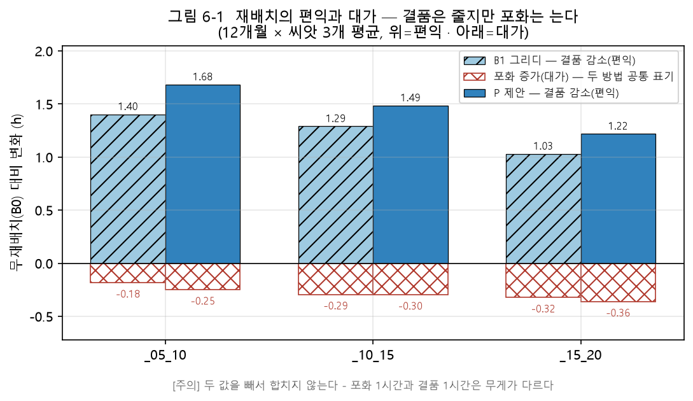
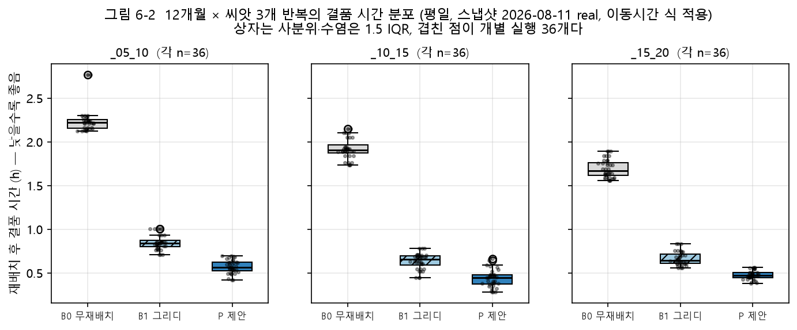
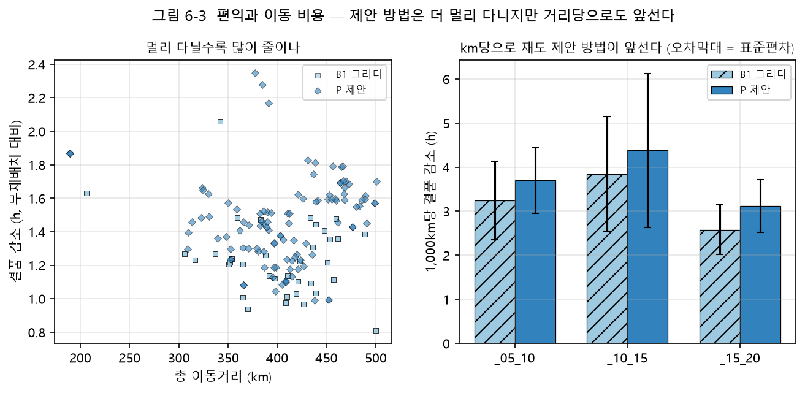

# 제6장 성능 평가

## 6.1 비교 설계

제5장까지의 실험은 제안 방법 안에서 어떤 값이 나은지를 물었다. 이 장이 묻는 것은 다른 것이다.
제안 방법이 더 단순한 방법보다 나은가. 재배치 전후를 자기 자신과 비교하면 어떤 방법이든 좋아
보이므로, 같은 입력과 같은 평가 기준으로 다섯 가지 방법을 나란히 실행하였다(<표 6-1>).

<표 6-1> 비교한 다섯 가지 방법

| 기호 | 방법 | 제안 방법에서 무엇을 뺀 것인가 |
| --- | --- | --- |
| P | 제안 방법 | — (군집화와 수급 균형 조정, 정수선형계획, 경로 휴리스틱) |
| B0 | 무재배치 | 전부. 재배치를 하지 않은 채로 둔 경우이다 |
| B1 | 그리디 | 군집화와 정수선형계획. 차량이 차고지에서 가까운 작업지를 계속 고른다 |
| B2 | 평균 목표 재고 | 안전재고($z=0$) |
| B3 | 지리 균등 군집 | 군집 목적함수의 수급 불균형 항 |

판정 지표는 결품 시간이다(1.5절). 개선률과 목표 도달률은 목표 재고를 분모로 삼으므로 안전계수가
다른 방법 사이에서는 비교가 성립하지 않아 쓰지 않는다(3.9절). 평가는 계획량이 아니라 경로 계산이
실제로 옮긴 대수로 한다. 계획으로 재면 군집화와 정수선형계획을 건너뛴 B1도 같은 양을 옮긴 것으로
세어져 방법을 구분하지 못하기 때문이다(7.2절).

모든 실행은 2026년 8월 11일 재고 스냅샷에 2025년 11월 평일 통계를 적용하고, 난수 씨앗 42로 한
결과이다. 이동시간은 식 (3.12)의 계수로 계산하였다. B2는 10~15시와 15~20시에 작업 대상을 하나도
만들지 못하여 값이 없다. 안전재고를 빼면 계획이 서지 않는다는 뜻이다.

## 6.2 결품과 포화

<표 6-2> 재배치 뒤의 결품 시간과 포화 시간 (대여소·일 평균, 단위: 시간)

| 회차 | 방법 | 결품 | 무재배치 대비 | 포화 | 무재배치 대비 |
| --- | --- | ---: | ---: | ---: | ---: |
| 05~10시 | B0 무재배치 | 2.40 | — | 1.36 | — |
| | P 제안 | 1.07 | −1.33 | 1.56 | +0.19 |
| | B1 그리디 | 1.30 | −1.10 | 1.52 | +0.15 |
| | B2 평균 목표 재고 | 1.55 | −0.85 | 1.46 | +0.10 |
| | B3 지리 균등 군집 | 1.86 | −0.53 | 1.48 | +0.11 |
| 10~15시 | B0 무재배치 | 1.76 | — | 1.02 | — |
| | P 제안 | 0.32 | −1.44 | 1.41 | +0.40 |
| | B1 그리디 | 0.55 | −1.22 | 1.40 | +0.39 |
| | B3 지리 균등 군집 | 1.46 | −0.30 | 1.20 | +0.18 |
| 15~20시 | B0 무재배치 | 1.64 | — | 1.00 | — |
| | P 제안 | 0.39 | −1.25 | 1.44 | +0.44 |
| | B1 그리디 | 0.60 | −1.03 | 1.36 | +0.36 |
| | B3 지리 균등 군집 | 1.24 | −0.40 | 1.18 | +0.18 |

주: 무재배치 대비는 반올림하기 전 값으로 계산하였다. 표에 적힌 두 값을 빼면 0.01시간이 다를 수 있다.

제안 방법이 세 회차 모두에서 결품이 가장 낮다. 무재배치 대비 1.25~1.44시간을 줄였고, 그리디보다
0.22~0.23시간 낮다. 수급 불균형 항을 뺀 B3는 옮기는 양 자체가 적어 감소폭이 3분의 1에 못 미친다.

재배치는 공짜가 아니다. 같은 실행에서 포화 시간은 모든 방법에서 늘어난다. 제안 방법은 0.19~0.44시간
늘었고, 증가량은 옮긴 대수를 따라간다. B3는 회차당 61~135대를 옮기며 0.11~0.18시간 늘었고, 제안
방법은 203~297대를 옮기며 그보다 많이 늘었다. 결품만 보면 많이 옮길수록 좋다는 결론이 나오지만,
포화를 함께 보면 그 결론에 한계가 있다.

두 지표를 더하여 하나의 값으로 만들지 않았다. 같은 시간 단위이지만 무게가 다르기 때문이다. 재고가
0인 시간과 거치대가 가득 찬 시간은 이용자가 겪는 일이 다르고, 합산 지표를 만들려면 그 가중치를
먼저 정해야 한다. 본 연구는 두 값을 따로 보고한다.

[그림 6-1]은 이 관계를 열두 달로 넓혀 본 것이다. 위로 뻗은 막대가 무재배치 대비 결품 감소이고, 아래로
뻗은 막대가 같은 실행에서 늘어난 포화이다. 두 방법 모두 편익이 대가보다 크지만 그 비는 회차에 따라
달라져, 05~10시에서는 편익이 대가의 예닐곱 배이고 15~20시에서는 서너 배이다.

[그림 6-1] 재배치의 편익과 대가 (12개월 × 씨앗 3개 평균, 평일, 2026년 8월 11일 스냅샷, 이동시간은
식 (3.12)의 계수). 위쪽 막대는 무재배치 대비 결품 감소이고 아래쪽 막대는 같은 실행의 포화 증가이다.
두 값을 빼서 하나로 합치지 않는다.

## 6.3 비용 — 옮긴 대수, 이동거리, 시간

<표 6-3> 같은 실행의 비용 (이동시간은 식 (3.12)의 계수로 계산)

| 회차 | 방법 | 옮긴 대수 | 이동거리 (km) | 투입 차량 | 가장 긴 운행 (분) | 예산을 넘긴 차량 |
| --- | --- | ---: | ---: | ---: | ---: | ---: |
| 05~10시 | P 제안 | 297 | 438.9 | 16 | 151.9 | 5 |
| | B1 그리디 | 328 | 436.1 | 15 | 119.5 | 0 |
| | B2 평균 목표 재고 | 171 | 302.9 | 11 | 146.9 | 3 |
| | B3 지리 균등 군집 | 135 | 244.3 | 12 | 113.7 | 0 |
| 10~15시 | P 제안 | 203 | 371.3 | 12 | 145.1 | 4 |
| | B1 그리디 | 216 | 351.9 | 11 | 118.5 | 0 |
| | B3 지리 균등 군집 | 61 | 111.4 | 5 | 113.9 | 0 |
| 15~20시 | P 제안 | 216 | 417.7 | 14 | 136.6 | 3 |
| | B1 그리디 | 243 | 438.8 | 13 | 119.7 | 0 |
| | B3 지리 균등 군집 | 65 | 135.4 | 6 | 112.8 | 0 |

제안 방법은 세 회차 모두에서 시간 예산 120분을 넘는다. 가장 긴 운행이 136.6~151.9분이고, 회차마다
3~5대가 예산을 넘는다. 그리디가 예산을 넘지 않는 것은 계획이 가벼워서가 아니라 예산이 찰 때까지만
담고 멈추는 방식이기 때문이다. 그래서 두 방법의 예산 초과 건수를 나란히 놓고 우열을 말할 수 없다.
제안 방법의 결품 이득은 예산을 넘겨서 얻은 것이며, 이 점은 초과 건수와 함께 읽어야 한다.

이 표의 시간은 이동시간 식을 교체하면서 드러난 값이다. 상수 속도를 가정하던 이전 계산에서는 같은
계획의 가장 긴 운행이 108.9~126.3분이었고 예산을 넘긴 차량은 한 회차에 한 대뿐이었다. 결품, 포화,
옮긴 대수, 이동거리는 소수점까지 같다. 계획이 나빠진 것이 아니라, 같은 계획을 실제 도로로 재자
시간이 드러난 것이다(3.8절).

## 6.4 12개월 반복과 통계적 유의성

한 달의 결과는 그 달의 수요에 기댄다. 그래서 자료가 있는 12개월에 난수 씨앗 셋을 곱하여 다시 재고,
같은 기간과 같은 씨앗끼리 짝지어 부호순위검정을 하였다(시간대별 $n=36$).

<표 6-4> 12개월 반복의 중앙값 차와 유의확률 (양수는 제안 방법이 결품이 낮다는 뜻)

| 회차 | 비교 | 결품 중앙값 차 (시간) | $p$ | 포화 중앙값 차 (시간) | $p$ |
| --- | --- | ---: | ---: | ---: | ---: |
| 05~10시 | P 대 B0 | +1.618 | $1.7 \times 10^{-7}$ | −0.237 | $1.7 \times 10^{-7}$ |
| | P 대 B1 | +0.276 | $1.7 \times 10^{-7}$ | −0.072 | $1.3 \times 10^{-5}$ |
| 10~15시 | P 대 B0 | +1.459 | $2.8 \times 10^{-7}$ | −0.317 | $2.8 \times 10^{-7}$ |
| | P 대 B1 | +0.219 | $1.7 \times 10^{-7}$ | −0.003 | $0.649$ |
| 15~20시 | P 대 B0 | +1.212 | $1.7 \times 10^{-7}$ | −0.386 | $1.7 \times 10^{-7}$ |
| | P 대 B1 | +0.183 | $1.7 \times 10^{-7}$ | −0.038 | $6.2 \times 10^{-6}$ |

결품에서는 세 회차 모두 제안 방법이 두 대조군보다 유의하게 낮다. 포화에서는 음의 부호가 제안
방법이 더 막는다는 뜻인데, 10~15시에서는 두 방법이 구분되지 않았다($p=0.649$). 포화 차이의 크기는
0.2~4.3분으로 같은 짝의 결품 이득(11.0~16.6분)의 1/64~1/4이다. 따라서 포화에 대해서는 두 방법이
같다고도, 제안 방법이 확실히 낫다고도 말하지 않는다. 크기로만 말한다.

[그림 6-2]는 그 중앙값 뒤에 있는 분포이다. 상자는 사분위 범위이고, 겹쳐 찍은 점이 개별 실행 36개이다.
세 회차 모두에서 제안 방법의 상자가 두 대조군보다 아래에 있고 상자끼리 겹치지 않는다. 다만 수염은
겹치므로, 특정한 달과 씨앗에서는 그리디가 제안 방법의 중앙값보다 나은 결과를 내기도 한다.

[그림 6-2] 12개월 반복의 재배치 후 결품 시간 분포 (평일, 씨앗 3개, 시간대별 $n=36$). 상자는 사분위
범위, 수염은 1.5 사분위수 범위이며, 겹쳐 찍은 점이 개별 실행이다.

## 6.5 대조군은 재는 자에 따라 달라진다

그리디 대조군은 이동시간 식을 바꾸면 계획 자체가 달라진다. 차량마다 시간 예산이 찰 때까지 작업지를
담으므로, 이동시간이 길어지면 한 대가 덜 담고 분할이 달라진다. 실제로 옮긴 대수는 같은데 이동거리가
372.5km에서 436.1km로 늘었고(05~10시), 결품은 1.15시간에서 1.30시간으로 나빠졌다. 결품 시간은 도착
시각이 아니라 집행된 재배치량으로 재므로(3.9절), 이 변화는 그리디가 다른 대여소를 채웠다는 뜻이다.

거리를 같게 놓고 보아도 제안 방법이 앞선다. 12개월 반복의 평균으로 100km당 결품 이득을 계산하면,
이전 계산에서는 제안 방법 0.360시간, 그리디 0.380시간으로 그리디가 오히려 높았다. 채택한 식에서는
0.360시간 대 0.310시간으로 뒤집힌다. 회차별로도 같다 — 05~10시 0.365 대 0.396에서 0.365 대 0.318로,
10~15시 0.411 대 0.449에서 0.411 대 0.367로, 15~20시 0.308 대 0.305에서 0.308 대 0.252로 바뀐다.

제안 방법 쪽 값은 한 자리도 바뀌지 않았다. 바뀐 것은 그리디뿐이다. 예산이 찰 때까지 담는 방식이
실제 이동시간에서는 같은 일을 하려고 13% 더 달리게 되고(354.1km에서 400.1km), 그러면서 이득은
1.347시간에서 1.241시간으로 줄기 때문이다. 제안 방법이 좋아진 것이 아니라 대조군이 실제 조건에서
무너진 것이다. 따라서 제안 방법의 우위를 더 멀리 다녀서 얻은 결과로 읽을 수는 없다. 다만 이 판단도
이동시간 식에 기대고 있으며, 상수 속도를 가정하던 동안에는 반대로 읽혔다(7.2절).

[그림 6-3]은 그 두 가지를 함께 본 것이다. 왼쪽은 실행별 총 이동거리와 결품 감소이고, 오른쪽은 거리로
나눈 값이다. 제안 방법은 05~10시와 10~15시에서 그리디보다 평균 10~19km 더 다니지만 15~20시에서는 12km
덜 다니며, 거리로 나눈 값은 세 회차 모두에서 제안 방법이 높다. 다만 실행마다 흔들림이 커서 표준편차가
겹치므로, 이 그림만으로 두 방법이 갈린다고 읽어서는 안 된다. 앞 문단의 값은 열두 달을 평균한 것이다.

[그림 6-3] 편익과 이동 비용 (12개월 × 씨앗 3개, 시간대별 $n=36$). 왼쪽은 실행별 총 이동거리와 무재배치
대비 결품 감소이고, 오른쪽은 1,000km당 결품 감소의 평균과 표준편차이다.

제안 방법은 군집을 먼저 고정하므로 같은 계획을 유지한다. 그래서 이동시간 식을 교체하면 두 방법의
격차가 벌어진다. 12개월 반복에서 결품 중앙값 차는 시간대에 따라 0.070~0.114시간에서 0.183~0.276시간이
되었다. 제안 방법이 좋아진 것이 아니라 대조군이 나빠진 것이며, 그 대신 제안 방법은 예산을 넘긴다.
어느 쪽이 나은지는 예산 초과를 어떻게 다룰지에 달렸고, 그 판단은 8.2절에서 한계로 정리한다.

## 6.6 읽는 법

이 장의 수치를 읽을 때 다섯 가지를 함께 보아야 한다.

첫째, 절댓값은 재고 스냅샷에 딸려 있다. 같은 코드와 같은 순수요로도 스냅샷이 다르면 값이 달라지므로,
다른 시점이나 다른 연구의 값과 직접 견주어서는 안 된다(8.3절).

둘째, 개선률과 목표 도달률은 이 장의 비교에 쓰지 않았다. 분모인 목표 재고가 안전계수에 따라 달라지기
때문이다.

셋째, 결품과 포화를 더하지 않는다. 두 시간의 무게가 다르다.

넷째, 씨앗에 따른 흔들림을 확인하였다. 한 달 비교는 씨앗 42의 결과이고, 12개월 반복은 씨앗 셋을
함께 돌린 결과이다. 씨앗은 군집 경계를 바꾸므로 경로 문제 자체를 바꾼다(3.7.2절).

다섯째, 제안 방법의 이득은 예산 초과와 함께 읽어야 한다. 예산을 실제로 강제하면 계획 물량의 15.9%를
옮기지 못한다(8.2절).

## 6.7 소결

제안 방법은 무재배치보다 결품을 1.21~1.62시간, 그리디보다 0.18~0.28시간 줄인다. 열두 달과 세 씨앗을
반복해도 방향이 바뀌지 않았고, 시간대별로도 유의하다. 그 대가는 둘이다. 포화가 늘고, 시간 예산을
넘는다. 포화 증가는 결품 이득의 1/64~1/4로 작으며 한 시간대에서는 구분되지 않았다. 예산 초과는
작지 않다. 회차마다 3~5대가 120분을 넘으며, 이는 제안 방법이 예산을 사후 점검으로만 다루기 때문에
생기는 결과이다. 무엇을 고칠 수 있고 무엇이 선택인지는 제7장과 제8장에서 다룬다.
