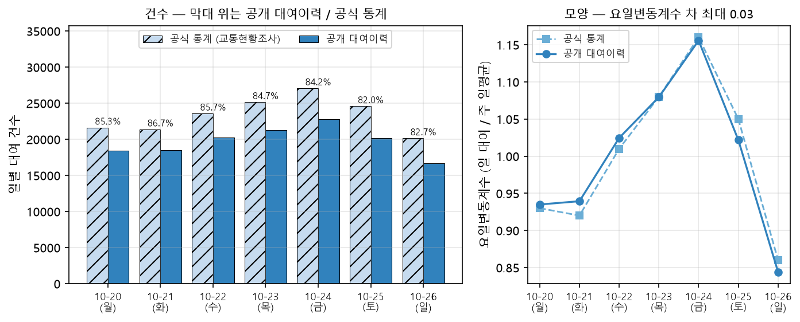
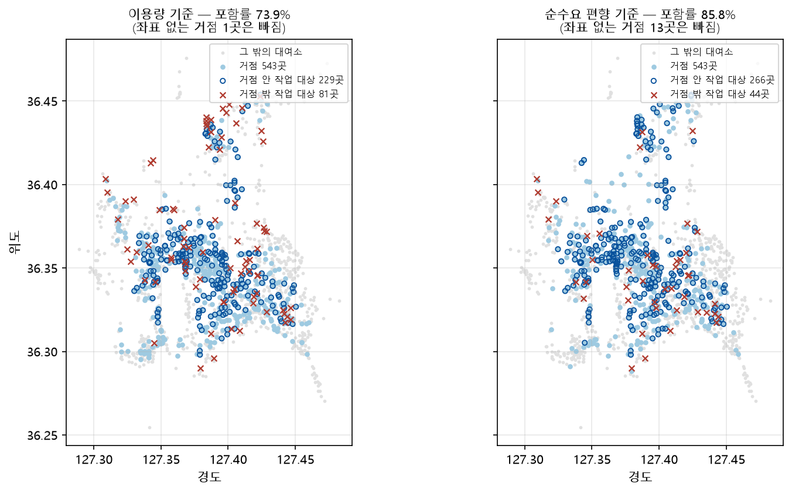

# 제8장 한계와 향후 과제

## 8.1 이 장의 원칙

이 장은 앞선 장들에서 드러난 한계를 크기와 함께 정리한다. 각 항목은 무엇이 한계인지, 측정한
경우 그 크기가 얼마인지, 지금 고치지 않은 이유가 무엇인지의 순서로 적는다. 크기를 재지 못한
한계는 재지 못하였다고 밝힌다.

한계는 네 갈래로 나눈다. 8.2절은 모형에 내재한 한계, 8.3절은 성과를 재는 방식의 한계, 8.4절은
운영 조건과 자료의 한계이다. 8.5절은 측정으로 효과를 확인하고도 의도적으로 계획에 넣지 않은
것을 다룬다. 8.6절은 이 한계들에서 나온 향후 과제를 제시한다.

## 8.2 모형의 한계

목표 재고 공식은 점 추정이다. 식 (3.4)의 $s\mu_i + z\,s\sigma_i$는 서비스 수준을 확률로 보장하는 구간 추정과
달리, 격차가 존재하여도 그 확률적 의미를 보장하지 않는다. 안전계수를 올려 커버리지를 높이는 것은
분포의 꼬리를 덮는 일이지, 목표 재고가 어떤 확률로 수요를 감당한다는 진술이 아니다.

채택한 $z=1.99$에서도 설계 의도인 95%에 이르지 못한다. 표본 밖 커버리지는 평일 94.9%, 휴일 93.7%이다.
휴일이 낮은 것은 휴일 수요가 유별나서가 아니라 학습 표본이 짧기 때문이며, 평일 표본을 같은 10일로
줄이면 93.8%로 같아진다(5.2.2절). 휴일 계획의 품질은 자료가 쌓이는 속도에 묶여 있고, 이는 안전계수로
덮을 수 있는 종류의 한계가 아니다.

계절 배율은 대여소마다 다른 반응을 담지 못한다. 보정은 도시 전체의 배율 하나를 쓰므로, 계절에 유독
민감하거나 둔감한 대여소의 차이는 그대로 오차로 남는다.

군집 조정의 상수들은 민감도를 측정하였다. 작업 대상 임계값과 군집 조정의 세 상수는 관행으로 정한
값이나, 각 격자를 4~8배 넓혀 흔들어도 결품 시간이 난수 씨앗에 의한 변동과 구분되게 움직이지 않았다
(신호 대 잡음비 1.27 이하). 다만 이는 현재값 주변이 평탄하다는 뜻이며, 격자를 벗어나면 결과가 나빠진다.

후보 상한 $N$은 최적값이 아니라 맞바꿈 위에 놓인 값이다. 모든 상한을 같은 모집단에서 평가하면 상한이
클수록 결품이 낮지만(3.4절), 같은 방향으로 집행이 어려워진다. 상한 100에서는 회차당 평균 12.0대 가운데
11.6대가 시간 예산을 넘겼다. 초과를 어디까지 허용할지가 정해져야 상한이 정해지므로, 이는 최적화 문제가
아니라 운영 정책의 선택이다. 상한을 내릴 때 작업 대상에서 빠지는 대여소의 형평성은 재지 않았다.

시간 예산은 제약이 아니라 사후 점검이다. 계획을 계산한 뒤 초과 여부를 표시할 뿐 계획을 바꾸지 않는다.
실제로 제약으로 걸면 계획 물량의 15.9%(681대 가운데 108대)를 포기해야 한다. 강제하지 않을 때 세 회차의
초과는 22건이고 최장 소요는 161~188분이다. 이 값은 정본 스냅샷으로 저장해 둔 계획의 이동 물량을 그대로 두고
경로만 다시 계산한 것이어서, 난수 씨앗 42로 군집화부터 새로 한 <표 6-3>의 계획과는 초과 건수와 최장 소요가
다르다. 어느 쪽도 싸지 않다 — 초과를 안고 가거나, 물량의 6분의 1을
버리거나, 차량을 늘리는 선택이 남는다.

군집화가 이동시간을 모른다. 군집 목적함수에는 거리 항이 있으나 시간 항이 없고, 회차당 군집 수를 정하는
식 (3.7)도 대여소당 이동시간 상수로 이동을 어림한다. 식 (3.12)를 채택한 뒤에도 같은 $K$가 나오는 이유가
여기에 있으며(3.5.1절), 그 $K$로 짠 계획을 채택한 식으로 재면 24개 조합에서 시간 예산 초과가 15건에서
90건으로 늘었다. 군집 수를 정하는 자와 그 결과를 채점하는 자가 서로 다른 셈이다. 시간 예산 초과의
근본 원인은 경로가 아니라 이 자리에 있다.

차량 한 대는 군집 하나에 고정된다. 여러 군집을 한 차량이 이어 도는 구조는 설계 초기에 검토하고 채택하지
않았으며, 그 이득과 대가는 7.5절에서 측정하였다. 두 군집씩 묶으면 차량 운행이 42회에서 21회로, 이동거리가
25.6% 줄지만 가장 긴 운행이 2.5시간에서 4.0시간이 된다. 현행 구조를 유지한 것은 이 소요시간을 현장이
받아들일 수 있는지 확인하지 못하였기 때문이며, 성능의 한계가 아니라 확인되지 않은 운영 조건에 따른
선택이다.

경로는 그리디 휴리스틱이어서 최적성 보장이 없다. 범용 최적화 도구와의 거리 손해는 3.7.2절에서 측정하였고,
대체하지 않고 갭을 재어 근거로 삼는 방식을 택하였다.

채택한 이동시간 식에도 한계가 남는다. 식 (3.12)는 1km 이하 구간을 평균 105~160초 과대평가하며, 0.5km
이하만 보면 평균절대오차가 상수 속도 가정보다 오히려 크다(3.8절). 직선 하나로 근거리와 원거리를 함께
맞추지 못한다는 뜻이며, 계획이 이 편향에 얼마나 민감한지는 재지 않았다. 계수를 추정한 고정 패널은
대여소 1,368곳 가운데 105곳만 지나므로 지역 편향이 남고, 경로 안내 서비스가 주는 값은 예측 이동시간이지
주행 기록이 아니다. 휴일 계수는 휴일 표본이 모일 때까지 평일 계수를 대신 쓴다.

## 8.3 측정의 한계

복원한 결품은 관측한 결품보다 작다. 제4장의 재고 시계열로 같은 시간대·같은 작업 대상 대여소를 맞추어
재면, 관측 결품이 복원 결품보다 평일 네 회차에서 11%, 18%, 42%, 78% 크고 휴일 15~20시에서 92% 크다.
방향은 여덟 칸이 모두 같다. 복원이 재고를 0에서 자르므로 빌리지 못한 수요가 사라지는 데 따른 것이며,
식 (3.13)의 결품이 하한이라는 3.9절의 서술과 일치한다. 따라서 제6장의 결품 절댓값은 하한으로 읽어야 한다.

이 비교를 개선률로 옮길 수는 없다. 관측 재고에는 대전교통공사가 실제로 수행한 재배치가 이미 반영되어
있어 관측 결품이 그만큼 낮아져 있다. 두 편향이 반대 방향이므로 위의 차이를 복원의 오차로만 읽을 수 없고,
둘을 가르는 일은 하지 않았다. 비교에 쓴 계획은 요일 구분을 기록한 실행으로 한정하였는데 휴일은 그런 실행이
하나뿐이므로, 휴일 쪽 수치는 방향을 보이는 값이다.

결품 시간의 절댓값은 재고 스냅샷에 딸려 있다. 대여소별 재고와 거치대 수는 실행 시각의 실시간 값이므로,
같은 코드와 같은 순수요를 써도 스냅샷이 다르면 다른 값이 나온다. 실제로 제6장의 표가 한동안 재현되지
않았고, 코드를 그 시점으로 되돌려 같은 자료로 돌려도 옛 값이 나오지 않아 원인이 스냅샷임을 확인하였다.
저장소는 라벨마다 현재 상태 한 벌만 보관하므로 과거의 스냅샷은 되살릴 수 없다. 그래서 본 논문은 비용
수치를 2026년 8월 11일 스냅샷 하나로 통일하고 표마다 그 조건을 밝혔다. 방법 사이의 비교는 같은 스냅샷
위에서 이루어지므로 유지되지만, 절댓값을 다른 시점이나 다른 연구의 값과 직접 견주어서는 안 된다.

통계적 유의성은 표본 크기와 재는 자에 함께 달려 있다. 5개월 반복($n=15$)에서 유의하지 않았던 포화
시간의 차이는 12개월($n=36$)에서 갈렸고, 이동시간 식을 채택한 계수로 바꾸어 같은 자료를 다시 재자
10~15시에서 다시 유의하지 않았다($p=0.649$). 유의성의 유무를 결론으로 그대로 옮길 수 없다는 뜻이며,
본 논문은 포화를 효과 크기로만 말한다(7.4절).

계획 대비 개선률은 이용자 편익이 아니라 계획 달성률이다. 3.9절에서 밝혔듯이 분모에 목표
재고가 들어가므로 구조적으로 높게 나오고, 안전계수가 다른 실행끼리는 비교가 성립하지 않는다.
실제로 $z$를 1.65에서 1.99로 올리자 결품 시간은 줄었는데 개선률과 목표 도달률은 함께 떨어졌다.
본 연구가 결품 시간을 판정 지표로 고정한 이유이다(1.5절).

중간 보고 단계에서 정한 성능 지표 하나를 측정하지 않았다. 본 연구는 중간 보고에서 성능
지표를 이용수요 충족도, 재고 균등성, 재배치 비용, 거치대 적정성의 넷으로 잡았다. 이 논문은 앞의
셋을 결품 시간, 포화 시간, 이동시간으로 다시 정의하였고 거치대 적정성은 다루지 않는다. 거치대
수는 운영기관이 정하는 시설 규모이며, 본 연구는 그것을 재고의 상한(포화 시간의 기준)으로만
쓰기 때문이다. 거치대 규모 자체가 적정한지는 재배치가 아니라 시설 투자의 판단이므로 8.6절의
향후 과제로 둔다.

## 8.4 운영 조건과 자료의 한계

### 8.4.1 확인한 값과 가정한 값

제1장에서 설계의 운영 조건을 문헌값 대신 확인을 거쳐 정하였다고 적었다. 그러나 확인의 수준은
조건마다 다르다(<표 8-1>).

<표 8-1> 운영 조건의 근거 수준

| 조건 | 사용한 값 | 근거 | 성격 |
| --- | --- | --- | --- |
| 차량 적재 용량 | 10대 | 운영기관 유선 문의(2026년 5월 15일) | 담당자 구두 답변. 통상 7대, 최대 10대 중 최대를 사용 |
| 보유 차량 | 21대 | 운영기관 유선 문의(2025년 9월 6일) | 담당자 구두 답변. 공개 자료로 교차 확인되지 않음 |
| 재배치 시각 | 하루 네 시간대 | 본 연구의 설계 | 운영기관은 재배치에 정해진 시각이 없다고 답함(같은 문의) |
| 회차 시간 예산 | 120분 | 본 연구의 설정 | 운영기관이 제시한 제약이 아닌 목표 |
| 싣기·내리기 시간 | 대당 30초 | 선행연구와 같은 가정(이은탁·손봉수, 2019) | 현장에서 측정하지 않음 |
| 거치대 수 | 대여소별 값 | 공개 API | 현장과 다른 일부를 현장 지도로 정정(1.2절) |

적재 용량은 2026년 5월 15일에, 보유 차량과 재배치 시각은 2025년 9월 6일에 대전교통공사 타슈
관제센터 담당자에게 유선으로 문의하여 들은 답변이다(대전교통공사 타슈 관제센터 담당자, 유선 문의,
2025년 9월 6일; 2026년 5월 15일).

보유 차량 21대는 공개 보도에 나오는 21과 다른 값이다. 2022년 보도는 타슈 수거 업무 담당자가 총 21명이며
7인 1개 조로 운영된다고 전하고, 차량 대수는 적지 않았다(김영일, 2022). 이 21은 사람의 수이다. 같은 보도는
취재한 담당자를 수거와 재배치를 함께 맡는 사람으로 소개하므로, 21명을 재배치만 하는 인력의 수로 읽을 수도
없다. 본 논문이 쓰는 21은 앞의 유선 문의에서 들은 차량의 대수이며, 수가 같다는 이유로 두 값을 같은 것으로
읽어서는 안 된다.

적재 용량 10대는 상한이다. 담당자는 자신이 알기로는 7대 정도를 싣고 많이 실어야 10대라고
답하였다. 자전거가 상하지 않도록 세워서 적은 수량만 싣기 때문이다. 본 연구는 상한인 10대를
썼으므로, 통상 적재량 7대로 계획하면 같은 작업에 더 많은 차량 운행이 필요하다. 그 크기는
재지 않았다. 적재 용량과 보유 차량은 모두 문서화된 차량 제원이 아니라 담당자의 구두 답변이므로,
본 논문에서는 "유선 문의로 확인한 담당자의 답변"으로 읽어야 한다.

시간 예산 120분은 목표이지 제약이 아니다. 따라서 이를 넘는 계획도 집행할 수 없는 것은 아니며,
본 연구는 초과분을 실패가 아니라 소요시간의 측정값으로 보고한다. 이 구분이 여러 군집을 이어 도는
구조에 대한 판단을 바꾼 경위는 7.5절에 있다. 반면 보유 차량과 적재 용량은 성격이 달라 이를 넘는
계획은 실제로 집행할 수 없다.

싣기·내리기 30초는 가정값이다. 계획의 소요시간은 이동시간과 작업시간의 합이므로, 이 값이
현장과 다르면 회차당 필요 차량의 추정이 함께 달라진다. 그 크기는 재지 않았다.

### 8.4.2 공개 대여이력과 공식 통계의 차이

본 연구는 공개 대여이력을 대여소 이용의 전부로 가정한다. 그러나 이 가정은 확인되지 않았다.
「2025년도 대전광역시 교통현황조사 및 분석보고서」의 조사 주간(2025년 10월 20~26일)과 같은
주의 공개 대여이력을 맞대면, 요일별 이용의 모양은 같지만(요일변동계수 차 최대 0.03) 일별 대여
건수는 보고서 값의 82.0~86.7%(주 평균 84.4%)로 날마다 비슷한 비율만큼 적다(대전광역시,
2025). [그림 8-1]은 두 자료를 날짜별로 맞댄 것이다. 한 지점에서는 차이가 크다. 보고서는 타슈관제센터의 반납을 하루 734건으로 적었으나, 공개
대여이력에서는 하루 29건으로 전체 174위이다.

[그림 8-1] 조사 주간의 공식 통계와 공개 대여이력의 일별 대여 건수 (2025년 10월 20~26일). 공식 통계는
대전광역시(2025)의 값을 옮긴 것이다.

같은 보고서는 대여소 기반 자전거와 별도로 대여소 없이 반납하는 방식의 자전거 대수를 함께
싣는다. 보고서의 이용 건수가 그 이용을 포함하였을 가능성과, 관제센터로의 회수·반납이 공개
대여이력에서 빠졌을 가능성이 있으나, 어느 쪽인지 문서로 가릴 수 없었고 운영기관에 따로 문의하지도
않았다. 누락이 대여소에 고르게 걸린 것이라면 순수요의 크기가 낮게 잡힐 뿐 방향은 유지된다.
그러나 관제센터 반납처럼 특정 지점에 몰린 것이라면 그 지점의 순수요는 부호까지 달라질 수 있다.

운영 중인 자전거 대수는 쓰지 않았다. 공식 자료가 싣는 대여소 기반 자전거 대수는 2020년
기준 값이 이후 판에 그대로 실린 것으로 확인되어(대전광역시, 2024) 현재 값으로 인용하지 않았다. 공개 대여이력에는
2025년 10월 한 달 동안 4,026대가 대여되었으나, 대여되지 않은 자전거는 셀 수 없으므로 이 값은
하한이다. 계획 계산은 대여소별 재고 스냅샷을 입력으로 받으므로 총 대수는 모형에 들어가지 않는다.
다만 시스템의 규모를 대수로 말하는 문장은 두지 않았다.

### 8.4.3 자료 기간

12개월 자료는 연속하지 않는다. 2025년 2월, 3월, 12월이 공개 자료에 없다(4.2절). 그래서
표본 밖 검증은 달이 이어지는 9쌍으로만 할 수 있었다(5.1절).

연도를 건너뛴 비교에는 성장이 섞인다. 같은 1월이라도 하루 평균 대여가 2025년 5,632건에서
2026년 8,764건으로 56% 늘었다. 서비스가 성장하는 중이므로, 해를 건너뛰어 달을 비교하면 계절의
효과와 성장의 효과를 가를 수 없다. 본 연구의 표본 밖 검증은 앞 달로 바로 다음 달을 평가하므로(5.1절)
이 문제를 피하지만, 전년 같은 달의 통계를 쓰는 방식은 이 때문에 검토하지 않았다.

휴일 관측은 평일보다 훨씬 적다. 결품 복원을 실측과 맞댈 수 있는 자료는 10분 간격으로 수집한
대여소별 재고 시계열뿐인데, 2026년 9월 22일까지 확보한 휴일 관측은 닷새이고 평일은 스무하루이다. 닷새 가운데
이틀은 하루 144회로 24시간을 온전히 덮었고, 나머지 사흘은 45회와 1회, 1회에 그친다. 온전한 이틀이 생기면서
휴일 결품을 복원과 맞대는 일은 15~20시 회차에서 처음 가능해졌으나(8.3절), 그 비교는 회차 하나와 이틀에
기댄 것이다. 본 연구는 10~15시와 15~20시에 평일과 휴일의 순수요 방향이 대여소의 33~37%에서 반대라는
이유로 모든 단계에서 두 요일 구분을 나누었으므로(1.2절), 휴일 쪽 서술은 평일 쪽과 같은 강도로 읽혀서는
안 된다.

### 8.4.4 대상과 운영 도구

한 도시, 특정 기간의 결과이다. 타슈는 대여소 1,368곳(실험에 쓴 재고 스냅샷 기준), 대여소마다 정해진 거치대, 차고지
하나로 이루어진 체계이다. 본 연구의 3단계 분해는 이 구조를 전제로 하므로, 차고지가 여럿이거나
대여소 규모가 크게 다른 도시에 그대로 옮길 수 있는지는 확인하지 않았다. 파라미터 $z$와
$\gamma$도 이 도시의 수요에서 정한 값이며, 다른 도시에서 같은 값이 좋다는 근거는 없다. 대여소가
없는 체계에 대해서는 8.6절에서 예비 검토 결과를 제시한다.

차량 결원 뒤의 형평성은 곧바로 회복되지 않는다. 4.5절의 결원 시험에서 배정은 결원 5대까지
성립하였으나, 결원이 끝난 뒤 차량별 누적 작업시간의 차이가 오히려 벌어졌다가 몇 회차에 걸쳐
돌아왔다. 누적이 적은 차량을 먼저 뽑는 규칙에서 나오는 설계된 동작이지만, 단기 형평성을 보장하지는
못한다.

웹 대시보드는 운영 환경에 그대로 배포할 수 있는 상태가 아니다. 인증과 권한 구분이 없고 로컬에서
띄우는 것을 전제로 한다(4.6절). 파이프라인 실행을 웹 요청으로 시작할 수 있으므로, 인증 없이
외부에 노출하면 누구나 계산 자원을 소모시킬 수 있다. 실제 운영에 쓰려면 인증, 권한, 접근 기록이
먼저 갖추어져야 한다.

## 8.5 알고도 계획에 넣지 않은 것 — 날씨

비가 오는 날 재배치 필요량이 줄어든다는 것을 측정하였으나, 계획에는 자동으로 반영하지 않는다.
화면은 예보를 알릴 뿐 목표 재고를 낮추지 않는다(4.6절).

측정은 12개월 자료에서 05~10시, 10~15시, 15~20시의 세 시간대를 평일과 휴일로 나누어, 작업
대상 대여소($|\mu| > 2$)의 평균절대오차로 하였다. 기준선은 직전 달 통계에 계절 배율을 적용한 현행
예측이고, 여기에 도시 전체의 하루 날씨 배율을 곱하는 것을 비교하였다. 비 오는 날은 해당 시간대의
강수가 1mm 이상인 날로, 시간대와 요일 구분에 따라 9~24일이다(<표 8-2>).

<표 8-2> 날씨 정보에 따른 작업 대상 예측 오차 개선 (비 오는 날, 세 시간대 × 평일·휴일 여섯 칸의 단순 평균,
강수 항만 바꾸어 비교)

| 날씨 정보 | 평균절대오차 개선 |
| --- | ---: |
| 관측 강수량 | +41.1% |
| 전날 발표 예보의 강수확률과 강수 유무 | +1.2% |
| 전날 발표 격자 예보의 강수량 | +13.1% |

비가 오면 대여와 반납이 함께 줄지만 서로 상쇄되지 않아, 비 오는 날의 재배치 필요량은 평소보다
45~61% 적었다. 관측 강수량을 넣으면 비 오는 날의 오차가 41.1% 줄었고, 비가 오지 않은 날에는 거의
달라지지 않았다. 날씨는 매일 조금씩 개선하는 처방이 아니라 비 오는 날의 큰 오차만 고치는
처방이다(7.2절).

그러나 계획에 쓸 수 있는 것은 관측이 아니라 예보이다. 강수확률과 강수 유무만으로는 개선이 1.2%에
그쳤다. 비가 얼마나 오는지가 이용을 가르는데 확률은 그 양을 담지 못하기 때문이다. 강수량을 주는
격자 예보를 넣자 개선은 13.1%로 커졌으나 관측의 약 3분의 1이었다.

자동 반영을 하지 않는 근거는 둘이다. 첫째, 화면이 판정만 하고 계획을 바꾸지 않는다는 설계
원칙이다. 자동 보정을 넣으면 기사가 손에 든 작업지시서와 화면의 숫자가 어긋난다. 이 원칙은
더 강한 신호인 관측 강수량을 두고도 정한 것이므로, 더 약한 예보 신호가 뒤집을 근거가 되지
않는다. 둘째, 위험이 비대칭이다. 예보가 비를 과대하게 말하면 계획량을 줄인 만큼 결품이 생기는데,
대전의 여름 강수는 국지적 집중호우가 많아 예보가 양을 빗나가기 쉬운 것으로 본다. 2026년 7월 9일
06시에 시간당 41.8mm가 관측되었을 때, 전날 예보는 그 시각을 포함한 다섯 시간의 합계를 27mm로
내었다.

이 측정에는 두 가지 한계가 있다. 강수는 관측소 한 곳의 값을 도시 전체에 썼으므로 대여소마다
다르게 오는 국지성 호우를 나누지 못한다. 또한 눈은 기록이 적고 대부분 이용이 적은 겨울 새벽에
몰려 있어 따로 재지 못하였다.

## 8.6 향후 과제

군집 수를 정하는 식에 시간을 넣는다. 식 (3.7)은 대여소당 이동시간 상수로 이동을 어림하므로, 이동시간
식을 바꾸어도 같은 군집 수를 낸다(8.2절). 좌표로 이동거리를 어림해 대신 쓰는 방식을 시험하였으나
채택하지 않았다. 24개 조합에서 결품은 6.7% 낮아지는 대신 시간 예산 초과가 2.2배로 늘었기 때문이다.
채택한 이동시간 식으로 다시 재어도 맞바꿈의 방향은 같았다. 결품은 11.7% 낮아지고 초과는 90건에서
199건이 되었다. 결품과 예산을 한 식에서 함께 다루는 설계가 필요하며, 이는 군집 수를 정하는 자와 그
결과를 채점하는 자를 같은 자로 맞추는 일이다.

여러 군집을 한 차량이 이어 도는 구조를 다시 묻는다. 이득과 대가는 7.5절에서 측정하였고, 남은 것은
측정이 아니라 판단이다. 한 차량의 운행이 네 시간에 이르러도 되는지, 회차의 경계를 어떻게 다시 그릴지는
운영 규칙에 달렸다. 묶는 규칙도 가까운 군집끼리 잇는 단순 규칙이므로, 묶기 자체를 최적화하면 이득은
지금 측정한 것보다 커진다.

복원과 관측의 차이를 두 원인으로 가른다. 8.3절에서 관측 결품이 복원 결품보다 크다는 것은 확인하였으나,
그 차이에는 두 원인이 반대 방향으로 섞여 있다. 복원이 재고를 0에서 자르는 데서 오는 몫과, 관측 재고에
이미 반영된 실제 재배치의 몫이다. 후자를 떼어 내려면 대전교통공사의 실제 작업 기록이 필요하며 본 연구는
그 자료를 갖고 있지 않다. 재배치가 드문 대여소만 골라 비교하는 방식으로 상한을 잡는 것은 가능하다.
휴일 쪽은 온전히 관측한 날이 이틀뿐이므로 회차를 넓히는 일이 먼저다(8.4.3절).

날씨 예보의 자동 반영은 조건이 갖추어지면 다시 논의한다. 예보의 강수량 정확도가 개선되거나,
예보 오차를 흡수하는 여유 계수처럼 틀린 예보가 결품을 만들지 않게 하는 완충 장치가 설계되면,
8.5절과 같은 판정 규칙으로 다시 잰다.

거치대 규모의 적정성을 따로 묻는다. 본 연구는 거치대 수를 주어진 상한으로만 쓴다(8.3절).
그런데 관측 재고에는 재고가 거치대 수에 닿는 포화가 실제로 나타나므로, 어느 대여소의 거치대가
수요에 비해 모자라는지를 같은 자료로 물을 수 있다. 다만 그 답은 재배치 계획이 아니라 시설 투자의
판단이며, 거치대를 늘리는 일과 자전거를 옮기는 일은 비용의 성격이 다르다. 재배치로 메울 수 있는
포화와 시설로만 풀리는 포화를 먼저 갈라야 한다.

대여소가 없는 체계에서도 같은 절차가 서지만, 단위를 고르는 기준이 바뀐다. 본 연구는 도크리스
체계를 구현하지 않으며 그 운영 방식을 제안하지도 않는다. 이 과제가 답하는 물음은 제안한 방법이
고정 대여소라는 단위에 의존하는가 하나이다. 대전시는 타슈에 QR 단말기를 부착하는 도크리스 병행
도입 사업을 편성하였고, 그 자문의견은 가상대여소의 위치 선정에 대한 분석이 필요하다고
적었다(대전광역시, 2024). 도크리스가 되면 재고를 세고 차량이 방문하는 단위인 고정 대여소가
사라지고, 그 자리를 거점(가상대여소)이 대신한다.

이를 12개월 이용 자료로 예비 검토하였다. 자료에 나타난 지점은 1,408곳, 대여와 반납의 끝점은
1,079만 건이다. 거점을 고르는 기준 둘을 같은 예산(543곳, 전체 지점의 38.6%)으로 비교하고, 5.1절의
재고 스냅샷으로 계산한 재배치 후보, 곧 재배치량의 절댓값이 2대를 넘는 대여소(후보 상한 $N$을 적용하기
전, 05~10시 310곳, 10~15시 152곳, 15~20시 167곳)가 거점 안에 드는 비율을 쟀다. 판정 기준은 두 기준 모두 자료를 보기 전에 정하였고, 여섯 달씩 묶은 비교만 결과를 본 뒤에
더한 탐색이다(<표 8-3>).

<표 8-3> 거점 선정 기준의 비교 (12개월 자료, 거점 543곳)

| 항목 | 이용량 기준 | 순수요 편향 기준 |
| --- | ---: | ---: |
| 재배치 후보 포함률 (세 시간대) | 64.7~73.9% | 70.7~85.8% |
| 같은 비율, 2025년 11월을 뺀 11개월로 거점을 고른 경우 | — | 71.3~85.5% |
| 대여·반납 끝점 가운데 거점에서 일어난 비율 | 80% | 70.1% |
| 인접한 달 사이 거점 집합의 자카드 계수 | 0.78~0.92 | 0.49~0.72 |
| 전반기 6개월과 후반기 6개월로 고른 거점의 자카드 계수 (사후 탐색) | 0.860 | 0.705 |

이용량 기준은 대여와 반납이 잦은 지점을 고른다. 이 기준으로는 끝점의 80%를 덮는 거점 안에 재배치
후보의 26~35%가 들지 않았고([그림 8-2]), 재배치 후보의 이용량 순위 중앙값은 1,408곳 가운데 318~386위였다. 옮겨야
할 곳은 많이 쓰는 곳이 아니었다. 불균형은 이용량이 아니라 대여와 반납의 차이에서 나오기 때문이다.
예컨대 하루 200번 빌리고 200번 반납되는 곳은 바쁘지만 균형이고, 30번 빌리고 5번 반납되는 곳은
한산하지만 매일 빈다.

순수요 편향 기준은 평일 시간대별 평균 순수요의 절댓값 가운데 최댓값으로 지점을 고른다. 재배치 후보도
순수요에서 나오므로 포함률이 높게 나오는 것은 부분적으로 구조적이다. 그래서 계획이 쓰는 달인
2025년 11월을 뺀 11개월로 거점을 골라 다시 쟀고, 값이 거의 같았다. 같은 거점이 끝점의 70.1%를
덮으므로 옮겨야 할 곳과 사람이 이용하는 곳을 한 집합으로 잡을 수 있다. 대가는 시간 안정성이다.
대여와 반납이라는 큰 두 수의 차이여서 한 달 표본에서는 잡음이 크고, 인접한 달 사이의 자카드 계수가
0.49~0.72로 떨어졌다. 여섯 달씩 묶어 고르면 0.705까지 회복되지만 이용량 기준(0.860)에는 미치지
못한다.

[그림 8-2] 거점 선정 기준별 거점과 05~10시 재배치 후보의 위치 (12개월 자료, 거점 543곳, 2025년 11월 통계와
2026년 8월 11일 재고로 세운 계획). 좌표는 재고 스냅샷의 대여소 정보에서 오므로 거기에 없는 거점은
그림에서 빠진다.

따라서 단위를 바꾸는 일은 새 모형이 아니라 두 규칙의 문제로 정리된다. 하나는 자전거의 위치를 어느
거점에 귀속시키고 거점의 재고를 어떤 반경으로 세는가이고, 다른 하나는 거점을 어떤 기준으로 고르는가
이다. 설계는 두 층으로 나뉜다. 거점의 위치는 여러 달(적어도 반년)을 묶은 순수요 편향으로 정해 자주
바꾸지 않고, 그 회차에 무엇을 옮길지는 지금처럼 매 회차의 순수요로 정한다. 거점은 물리적 위치이므로
위의 안정성 저하는 한계로 남는다.

이 검토의 수치는 상한이다. 이용 자료의 좌표는 대여소의 좌표이므로 도크리스에서 자전거가 실제로
놓이는 위치를 관측한 것이 아니며, 전환 뒤에는 같은 수요가 더 흩어져 포함률과 끝점 비율이 이보다
낮아진다. 또한 포화 시간은 거치대 수를 상한으로 쓰므로 도크리스에서는 정의되지 않는다. 한 곳에
자전거가 쌓여 보행을 방해하는 같은 문제를 보행 공간을 기준으로 다시 정의해야 한다.

결품 확률 예측을 계획에 연결한다. 관측 재고로 1시간 뒤에 대여소가 비어 있을 확률을 맞히는
분류 모형은 사전에 정한 조건을 통과하였고, 평소 빈도가 비슷한 대여소끼리 나누어 물어도 우위가
유지되었다(3.3.4절, 7.5절). 그러나 확률은 어디가 빌지를 말할 뿐 얼마나 옮길지를 말하지 않는다.
현재의 재배치량(목표 재고와 현재 재고의 차이)과 어떻게 합칠지를 먼저 설계하고, 합친 선택으로 물량
배분과 경로를 계산해 결품, 포화, 이동거리를 대조군과 같은 방식으로 재야 채택 여부를 말할 수 있다.
학습 자료가 평일 13일의 주간뿐이므로 휴일과 야간 회차는 재고 시계열이 쌓인 뒤 따로 판정한다.
