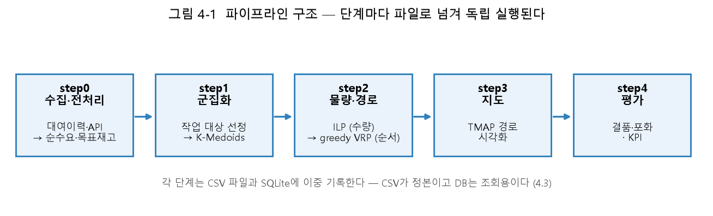

# 4장 시스템 설계 (초안)

> **이 파일은 논문 문장 초안입니다.** [THESIS.md](../THESIS.md) 11장의 4장 항목을
> 따라 [PROJECT_PIPELINE.md](../../구현/PROJECT_PIPELINE.md)·[DB_SCHEMA.md](../../구현/DB_SCHEMA.md)·
> [WEBAPP.md](../../구현/WEBAPP.md)·[FLEET.md](../../구현/FLEET.md)를 문장으로 옮긴 것입니다.
> 시스템 구조도(mermaid)는 원본 문서의 것을 그대로 재사용할 수 있다.

---

## 4.1 전체 구조 — End-to-End 파이프라인



**그림 4-1** 파이프라인 구조. 각 단계는 파일로 결과를 넘기며 독립 실행된다.
재현: `python tools/make_thesis_figures.py --only 4-1`

본 연구의 시스템은 원천 데이터 수집부터 재배치 계획, 지도 시각화, 성과
평가까지를 하나의 흐름으로 잇는 파이프라인 구조다. 전체 단계는 다음과 같다.

```text
TASHU Open API ──┐
                  ├─▶ 대여소 정보 통합 ─▶ 순수요 계산 ─▶ 목표 재고·재배치량
공공데이터포털 이력 ┘                                          │
                                                              ▼
                                              Pick·Drop 선정 ─▶ K-Medoids 군집화
                                                              │
                                                              ▼
                                              ILP(수량 최적화) ─▶ VRP(차량 경로)
                                                              │
                                                              ▼
                                          TMAP·Folium 지도 ◀──┴──▶ 불균형 개선 평가
```

각 단계는 폴더·파일명 규약을 지키는 CSV로 통신하며(`data/pp_data/` 하위),
파일명에는 실행을 구분하는 라벨(`{now}`)과 시간대(`{duration}`)가 들어간다.
저장소 최상위는 파이프라인(`pipeline/`), 웹 대시보드(`webapp/`), 문서(`docs/`)
등 분야별 대분류로 나뉜다. `pipeline/` 안은 다시 데이터 처리 단계
(`step0_collect`, `step0_eda`), 최적화 단계(`step1_cluster`, `step2_optimize`),
시각화·평가 단계(`step3_map`, `step4_metrics`)로 나뉜다.

## 4.2 단계별 처리

**Step 0 — 수집과 전처리.** TASHU Open API로 대여소별 현재 재고를 조회하고,
공공데이터포털의 월별 대여 이력 CSV를 병합해 대여소 정보(좌표, 거치대 수)를
통합한다. 이어서 시간대·대여소별 순수요를 대여량과 반납량의 차이로 집계하고,
평균·표준편차로부터 목표 재고와 재배치 필요량을 계산한다(수식은 3장).

**Step 1 — 선정과 군집화.** 재배치량의 절댓값이 임계값을 넘는 대여소를
Pick·Drop으로 분류하고, K-Medoids로 공간적으로 인접한 대여소를 묶은 뒤
군집 간 수급 불균형과 크기 편차를 줄이는 방향으로 재조정한다.

**Step 2 — 최적화.** 정수선형계획법(ILP)으로 군집 안에서 Pick 대여소로부터
Drop 대여소로 옮길 자전거 수를 정하고, 차량경로문제(VRP)로 그 이동을
수행할 방문 순서를 만든다. 결과에는 구간별 거리·이동시간·작업시간·누적시간과
배정된 차량 ID가 함께 기록된다.

**Step 3 — 지도 시각화.** VRP 경로와 Pick·Drop 마커, 군집 정보를 Folium
지도에 표시한다. 경유지가 많은 구간은 TMAP Routes API로 구간을 나누어
호출한 뒤 병합한다.

**Step 4 — 성과 평가.** 재배치 전후의 불균형을 비교하고, 클러스터별 이동
거리·시간을 집계해 성과 지표(`kpi_summary`)로 저장한다. 주 지표인 결품
시간의 정의와 그 하한적 성격은 3장·7장에서 다룬다.

전체 실행은 `run_pipeline.py`가 위 순서를 통제하며, 개별 단계는 독립
실행이 가능하고 같은 공통 옵션(`--now`, `--period`, `--duration`,
`--day-type` 등)을 공유한다.

## 4.3 데이터 저장소 — SQLite 이중 기록

시스템은 CSV 파일과 SQLite 데이터베이스(`data/bike_system.db`, WAL 모드)에
결과를 이중으로 기록한다. CSV가 여전히 정본이며, DB 기록이 실패해도 파이프라인은
경고만 남기고 계속 진행한다 — 이는 전환기 설계이며, DB 도입이 계획 산출
자체를 막아서는 안 된다는 원칙에 따른 것이다.

DB는 20개 테이블로 구성되며, 이를 이해하는 핵심은 테이블 구조 자체보다
**한 행이 무엇에 속하는가**라는 스코프 개념이다.

| 스코프 | 키 | 해당 테이블(예) |
| --- | --- | --- |
| 실행 | `run_label` | `station_stock`, `station_info` |
| 실행 + 회차 | `run_label` + `duration` | `pick_drop`, `ilp_plan`, `vrp_plan`, `kpi_summary` |
| 기간 | `period` | `net_demand`, `rental_history` — 순수요는 실행이 아니라 원천 데이터 기간에 속한다 |
| 관측 시각 | `observed_at` | `stock_history` — 파이프라인 실행과 무관한 실측 재고 시계열 |
| 전역 | — | `vehicle` |

`net_demand`를 실행이 아니라 기간 스코프로 둔 것이 이 설계의 핵심 판단이다.
순수요는 과거 대여 이력에서만 산출되므로 언제 분석하든 같은 값이기 때문이다.
외래키는 선언돼 있지 않으며, 대신 복합 기본키와 스코프별 선삭제 후 삽입
방식으로 멱등성과 무결성을 지킨다.

## 4.4 차량 운용 — 로테이션과 형평성

시스템은 실제 운용 방식(보유 차량 21대, 하루 3회차, 회차마다 일부만 투입)을
반영하기 위해 별도의 차량 배정 계층을 둔다. 회차당 투입 대수는 고정값이
아니라 그 회차의 추정 작업량이 정하며, 배정은 누적 작업 시간이 적은 차량부터
뽑아 가장 무거운 군집을 맡기는 두 단계 규칙으로 이루어진다. 별도의 순번표
없이 누적 기록만으로 로테이션이 자연스럽게 형성되도록 설계했으며, 이는
차량이 정비로 빠지거나 회차 수가 바뀌어도 규칙이 그대로 성립하게 하기 위함이다.

**보유 차량 21대는 운영 주체에 유선으로 문의해 확인한 값이다.** 대전교통공사
타슈 관제센터에 문의해(2025년 9월) 총 21대를 보유하되 한 번에 전부 투입하지 않고
조를 나눠 운용한다는 답변을 얻었으며, 이는 본 시스템의 배분 모델(21대 보유,
회차마다 필요한 만큼만 투입)과 일치한다.
모형이 산출한 회차당 소요 대수는 12~16대로, 보유량 안에서 로테이션 여유가
확보된다. 이 값을 확정하는 과정에서, 신문 기사가 전한 현장 기사 수(21명,
7인 1개 조)를 그대로 차량 대수로 옮기지 않기로 한 판단도 함께 기록해 두었다 —
해당 기사의 "수거"가 재배치가 아니라 정비 회수를 가리키는 다른 업무였고,
조사 시점(2022년 12월)의 운영 규모가 현재와 달랐기 때문이다. 즉 21이라는
총량은 문의로 확인한 값이고, 본 연구가 얹은 것은 그 21대를 회차별로 어떻게
나눠 쓰는가라는 배분 로직뿐이다.[^1]

[^1]: 근거는 [FLEET.md](../../구현/FLEET.md)와
    [ORIGINS.md](../../기록/ORIGINS.md) 4장 *"'21'의 출처"* 절
    (2025년 9월경 대전교통공사 타슈 관제센터 유선 문의).
    (초안 메모) 8장(한계)에서 이 값을 **"설계값"이라 부르지 말 것** — 21대 총량은
    본 연구가 정한 값이 아니라 운영 주체에게서 받은 값이다. 8장에서 밝힐 한계는
    ⓐ 문서화된 제원이 아니라 **담당자 구두 진술**이라는 점, ⓑ 공개 자료에 차량
    대수가 없어 **교차검증되지 않는다**는 점, ⓒ 2022년 보도의 수거 인력 21명과
    숫자가 겹치므로 각주에서 미리 구분해 둘 것, 이 셋이다.

## 4.5 웹 대시보드

파이프라인 실행과 결과 열람을 위해 FastAPI + Jinja2 기반의 웹 대시보드를
구현했다. 별도의 프런트엔드 빌드 없이 서버 렌더링만으로 동작하며, 주요
화면은 다음과 같다.

| 화면 | 기능 |
| --- | --- |
| 실행 폼 | 기간·시간대·요일 구분·차량 대수 등을 지정해 파이프라인을 백그라운드로 실행 |
| 성과 지표 | 실행별 KPI와 직전 실행 대비 증감을 표와 그래프로 제시 |
| 차량 운용 | 차량별 누적 작업량·형평성·회차 배정 이력 |
| 작업지시서 | 차량별 방문 순서·수량을 인쇄 가능한 형태로 제공. **판정만 하고 계획을 바꾸지 않는다** |
| 실시간 재고 대조 | 출발 직전 계획 대상 대여소만 API로 다시 조회해 집행 가능 여부를 판정 |
| 지도·데이터 | 단계별 산출 지도와 CSV의 열람·다운로드 |

산출물 조회 API는 SQLite를 읽으며 `run_label`로 과거 실행분도 조회할 수
있다. 파이프라인 로직은 웹 요청 안에서 직접 실행하지 않고 별도 프로세스로
백그라운드 실행한다(전체 실행에 수 분이 걸리기 때문이다).

**설계에서 일관되게 지킨 원칙은 "화면은 판정만 하고 계획을 자동으로
바꾸지 않는다"는 것이다.** 작업지시서와 실시간 재고 대조가 이 원칙을
따르며, 비가 오는 날 실제 필요량이 줄어든다는 사실을 화면이 알리더라도
계획량 자체는 바꾸지 않는 것(7·8장에서 다시 다룬다)도 같은 이유에서다 —
자동 보정을 넣으면 기사가 손에 든 작업지시서와 화면의 숫자가 어긋난다.

## 4.6 재현성과 테스트

전체 시스템은 678개의 자동화된 테스트로 검증되며, 합성 데이터를 이용해
데이터 없이도 파이프라인 전 구간의 실행 가능성을 확인할 수 있다. API 키와
원천 데이터는 버전 관리 대상에서 제외되어 있어, 재현하려는 사람은 자신의
API 키와 데이터를 준비해야 한다.[^2]

[^2]: 수치는 2026-09-07 기준이다. **손으로 세지 말 것** —
    `python tools/check_consistency.py`가 `pytest --collect-only`로 실제
    개수를 세어 문서와 대조하므로, 개수가 바뀌면 검사기가 먼저 알린다.
    (초안 메모) 제출 직전에 한 번 더 돌려 확인할 것.

## 관련 문서

| 문서 | 내용 |
| --- | --- |
| [PROJECT_PIPELINE.md](../../구현/PROJECT_PIPELINE.md) | 파이프라인 구조와 데이터 흐름 |
| [DB_SCHEMA.md](../../구현/DB_SCHEMA.md) | ERD와 테이블 레퍼런스 |
| [WEBAPP.md](../../구현/WEBAPP.md) | 웹 대시보드 상세 |
| [FLEET.md](../../구현/FLEET.md) | 차량 로테이션·형평성 설계 |
